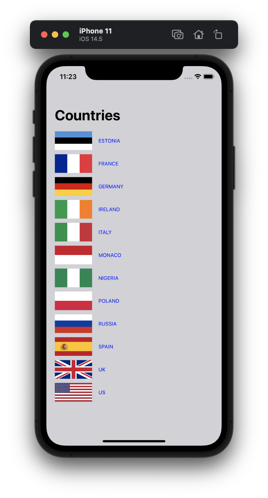
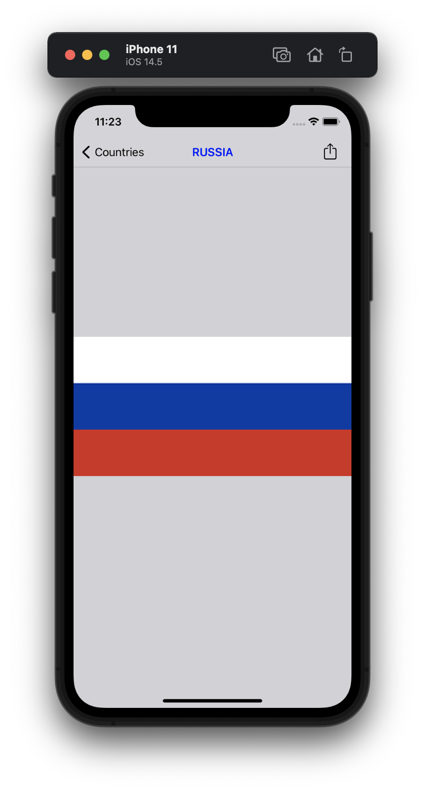
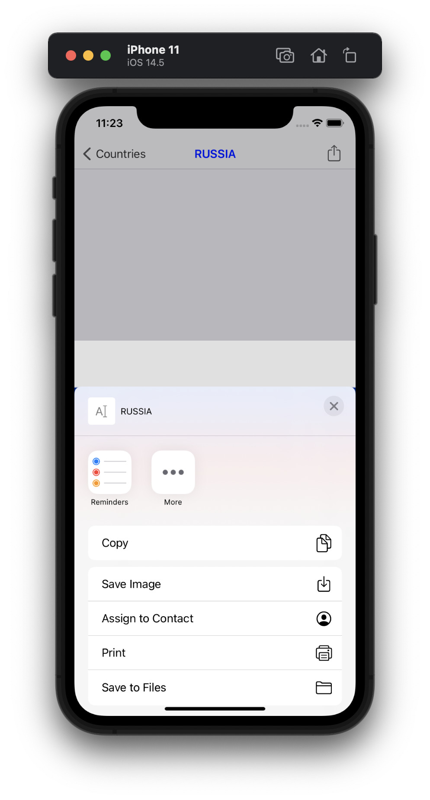

#  Milestone: Project 1-3

Unaided iOS developing project in "100 days of Swift" challenge on website: www.hackingwithswift.com

In this project we remember learned practice from projects 1-3 and implemented simple album with flags and additional view controoler which supported showing flag in full size and sharing on socialnets enc. through Activity View Controller.

## Demonstration

First view with list of flags:

Second view with full image and sharing button in Navifation Bar:

Sharing window through Activity View Controller:

