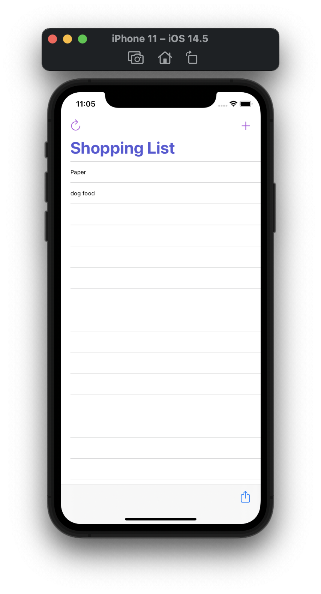
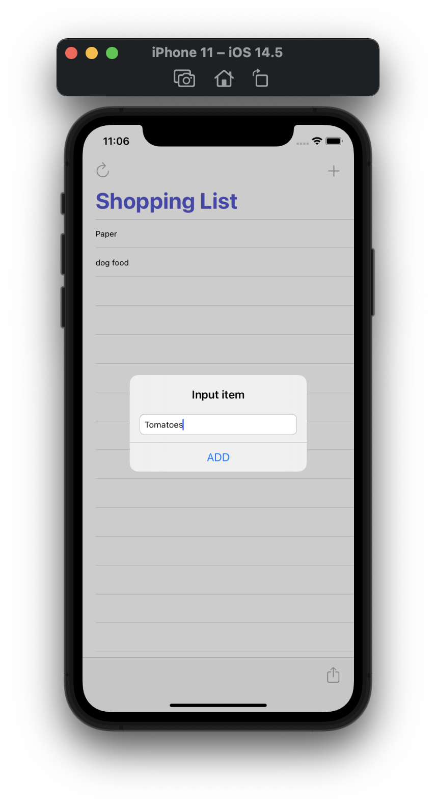
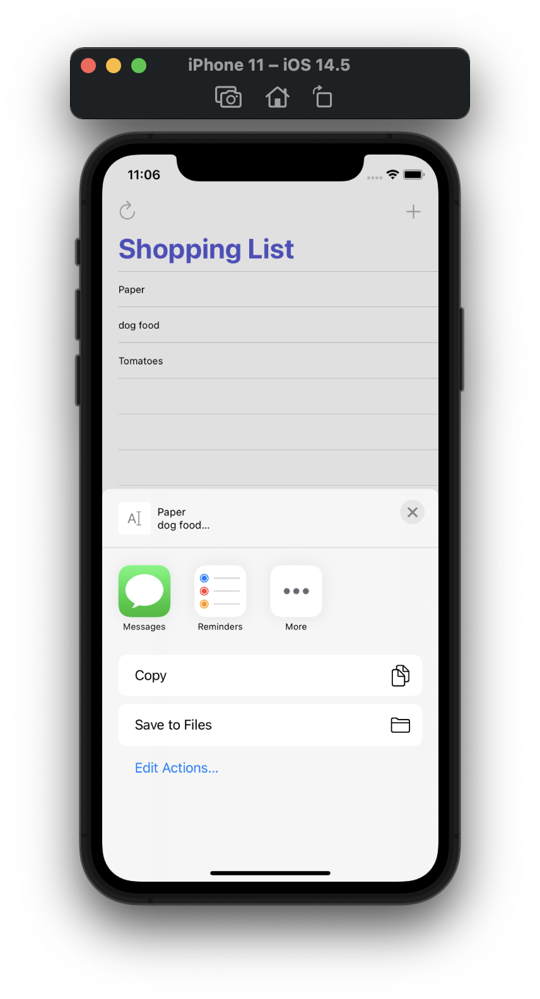
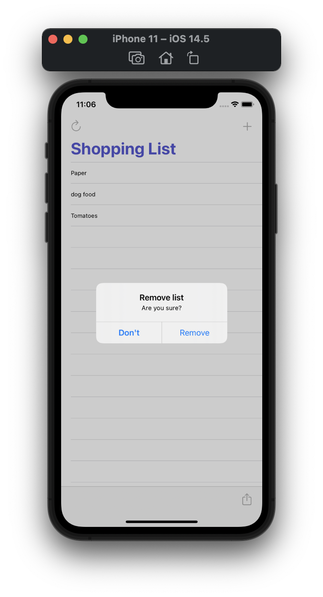

#  Milestone Project 4-6

Unaided iOS developing project in "100 days of Swift" challenge on website: www.hackingwithswift.com

In this project we remember learned prectices from Projects 4-5 and created simple shopping list with possibility adding items, removing list and sharing it. We practiced with UIAlertController, UITableViewController, Navigation and Tool bars.

## Demonstration

Start view, shopping list:

Alert Controller with text field for adding item to list:

After tapping sharing buttom. Each position is separated by a new line.

Alert Controller for removing list:

