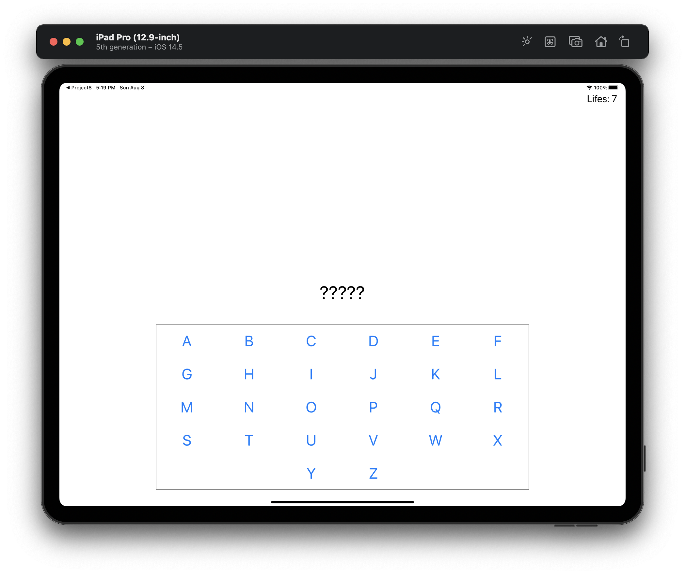
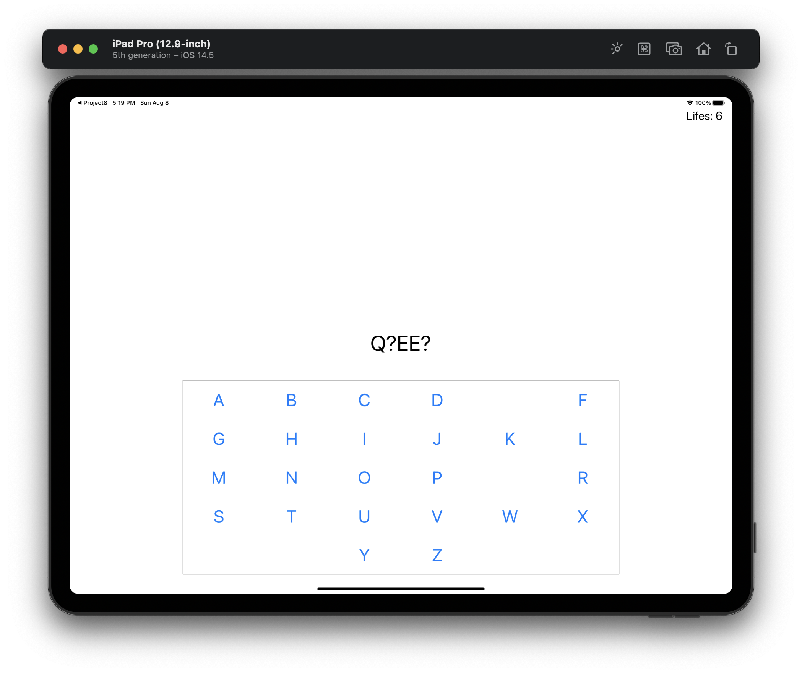
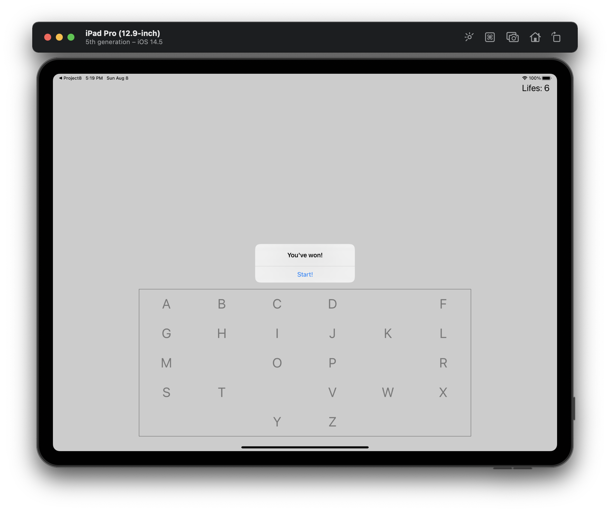

#  Milestone Project 7-9

Unaided iOS developing project in "100 days of Swift" challenge on website: www.hackingwithswift.com

In this project we remember learned practices from Projects 7-9 and created simple game like a hangman game with UIKit using. We created all layout of graphicals elements and constraints in code, worked with file, strings and used some multithreading.  

The essence of the game is as follows: a hangman game, this means choosing a random word from a list of possibilities, but presenting it to the user as a series of underscores. So, if your word was “RHYTHM” the user would see “??????”. The user can then guess letters one at a time: if they guess a letter that it’s in the word, e.g. H, it gets revealed to make “?H??H?”; if they guess an incorrect letter, they inch closer to death. If they seven incorrect answers they lose, but if they manage to spell the full word before that they win.

## Demonstration

Start screen when game starts.

Screen when some letters is known.

Alert Controller with "Won" message and suggestion to restart game.

