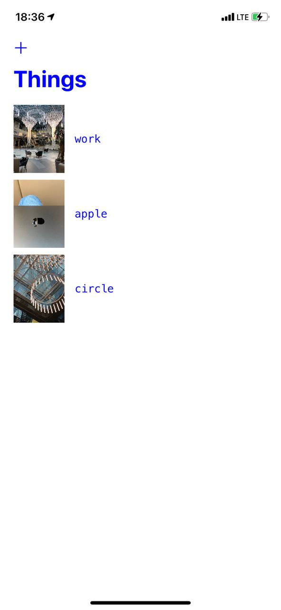
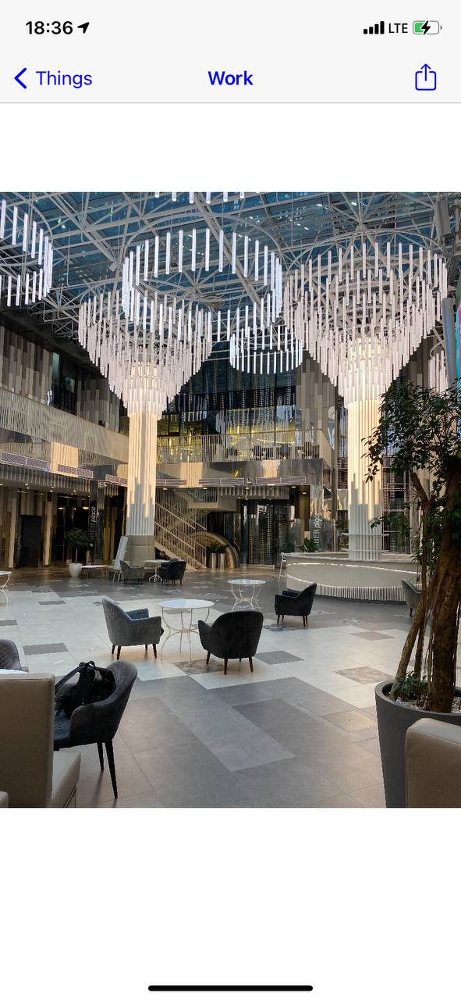
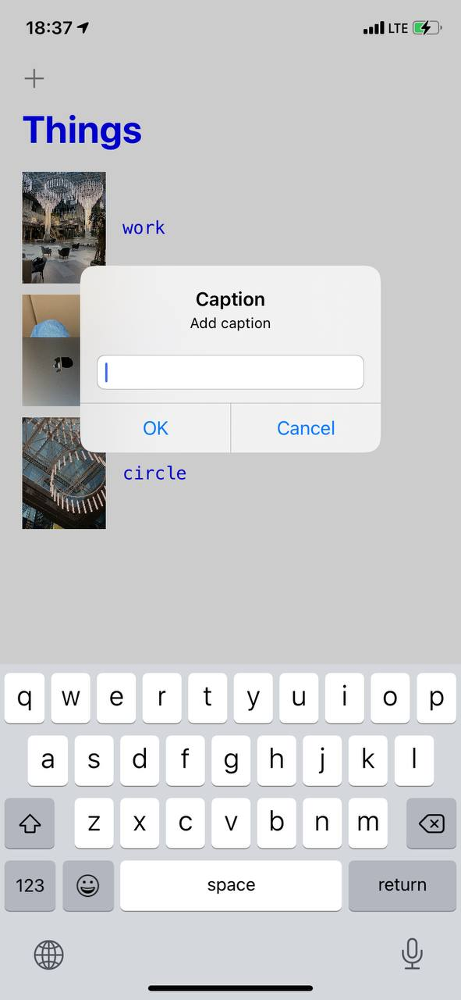
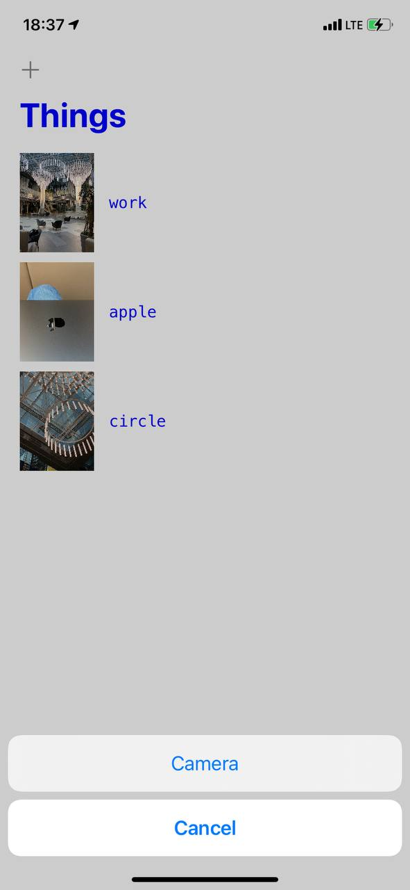

#  Milestone Projects 10-12

Unaided iOS developing project in "100 days of Swift" challenge on website: www.hackingwithswift.com

In this project we remember learned practices from Projects 10-12 and created simple list of things which contains images (created by user using camera) and caption of this. This project using elements from both [Project 1](https://github.com/elfortitude/100_Days_of_Swift/tree/main/Project1) and [Project 12](https://github.com/elfortitude/100_Days_of_Swift/tree/main/Project12b). We used Table View Controller for table and cells layout, Navigation Controller for navigation and segue between scenes, UserDefaults for saving and loading data from app's directory.  

The essence of our app is as follows: we let users take photos of things that interest them, add captions to them, then show those photos in a table view. Tapping the caption show the picture in a new view controller, like we did with [Project 1](https://github.com/elfortitude/100_Days_of_Swift/tree/main/Project1). So, our project is a mixture of [Project 1](https://github.com/elfortitude/100_Days_of_Swift/tree/main/Project1) and [Project 12](https://github.com/elfortitude/100_Days_of_Swift/tree/main/Project12b).

## Demonstration

Start screen with list of things containing images and captions.

After tapping on cell we show fully image in second View Controller using Image View. Also we can share image.

Adding new thing: first we add a caption in text field inside Alert Controller, and then we showing action sheet Alert Controller with open camera ability.

