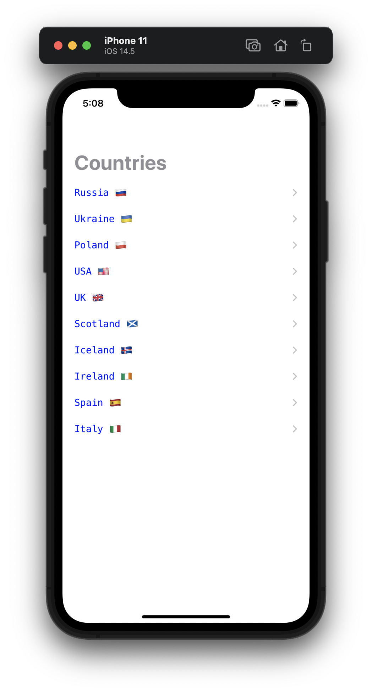

#  Milestone Projects 13-15

Unaided iOS developing project in "100 days of Swift" challenge on website: www.hackingwithswift.com

In this project we remember learned practices from Projects 13-15 and created simple list of countries with showing some captions and facts about each other using JSON parsing from local file.  This project using elements from both [Project 1](https://github.com/elfortitude/100_Days_of_Swift/tree/main/Project1) and [Project 7](https://github.com/elfortitude/100_Days_of_Swift/tree/main/Project7). We used Table View Controller for output list of countries, Navigation Controller for navigation and segue between main screen and detail screen, JSON decoder for parsing data. 

The essence of our app is as follows: we storage list of countries and user can tap on any country and see caption and some facts about it. So, our project is a mixture of [Project 1](https://github.com/elfortitude/100_Days_of_Swift/tree/main/Project1) and [Project 7](https://github.com/elfortitude/100_Days_of_Swift/tree/main/Project7).

## Demonstration

List of countries:

Detail view with caption about selected country:

