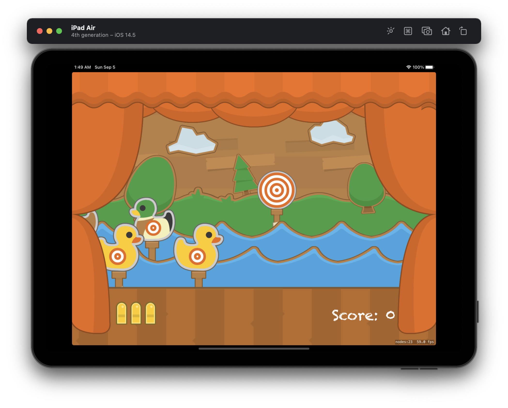

#  Milestone: Projects 16-18

Unaided iOS developing project in "100 days of Swift" challenge on website: www.hackingwithswift.com

In this project we remember about SpriteKit framework from Apple and created simple 2D game using some features from [Project 14](https://github.com/elfortitude/100_Days_of_Swift/tree/main/Project14). 

The essence of our app is as follows: this is a shooting gallery.

## Demonstration

General screen of the game.

"Game over" label, then game will start again.

