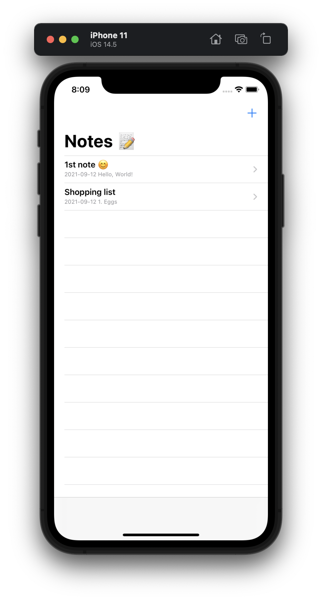
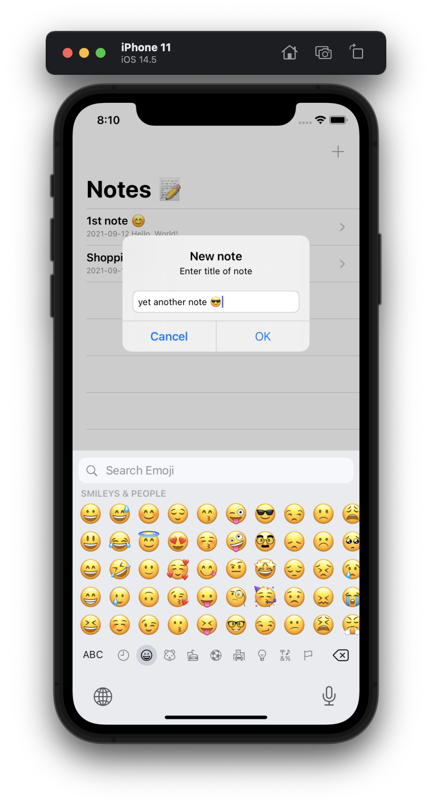
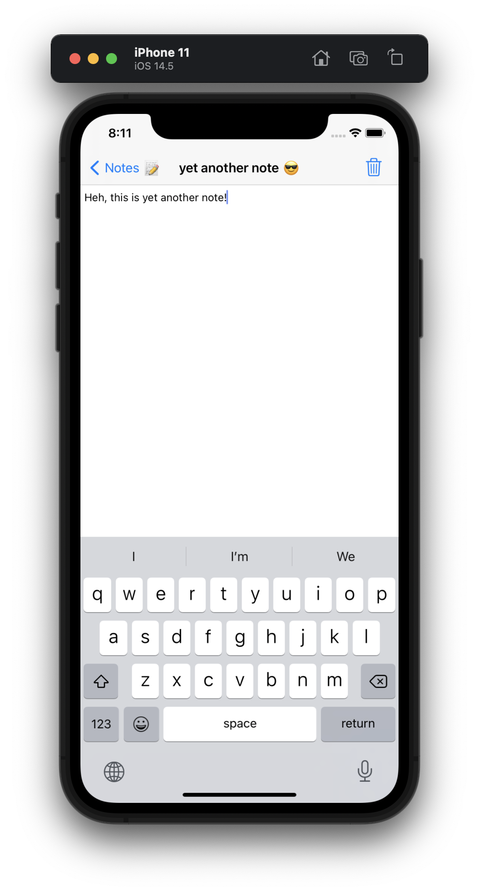
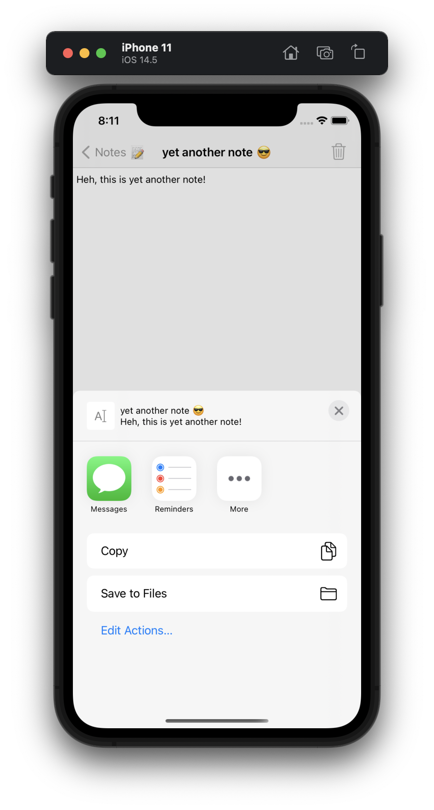
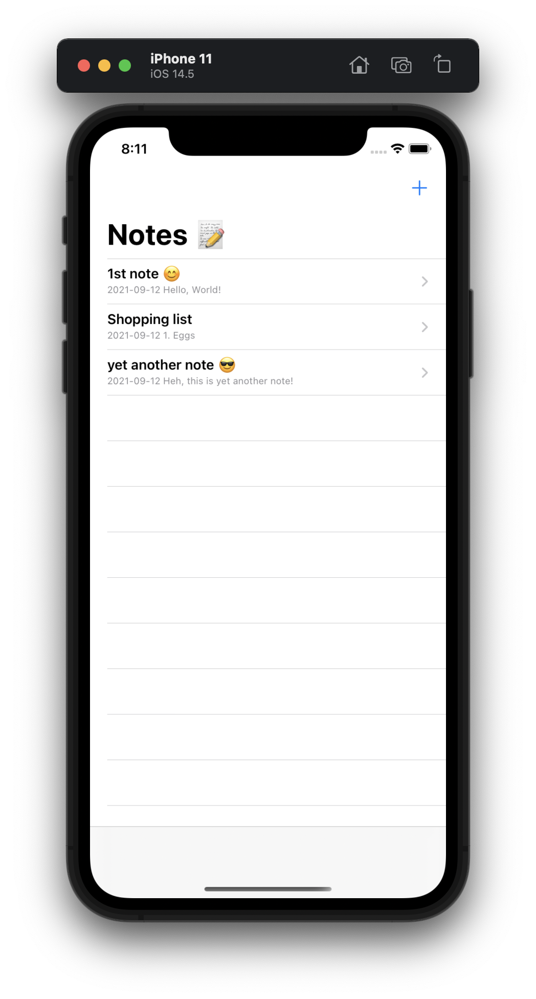
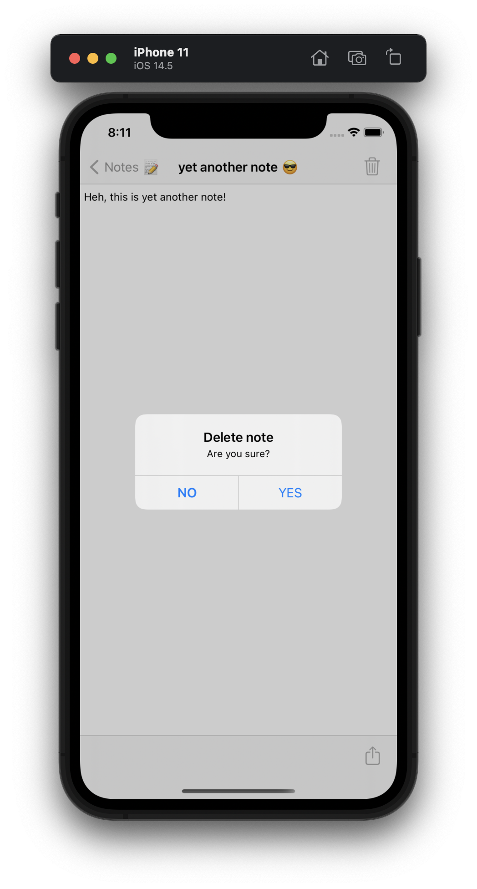

#  Milestone: Projects 19-21

Unaided iOS developing project in "100 days of Swift" challenge on website: www.hackingwithswift.com

In this project we created notes app. We remember [Project 1]() with Navigation Controller, [Project 19]() with Text View and Notification Center for keyboard recognizing, [Project 12]() with User Defaults and Codable for saving and loads notes, [Project 4]() with toolbar items and [Project 3]() with Activity View Controller for sharing notes. 

## Demonstration

List of the notes stored in UserDefaults.

Adding new note: enter title, then enter body of the note.

Also you can share your note.

List with one new note.

You can delete your note (from UserDefaults also).

