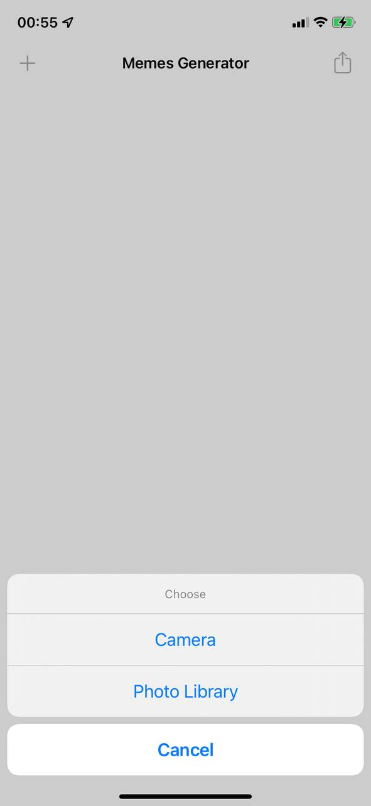
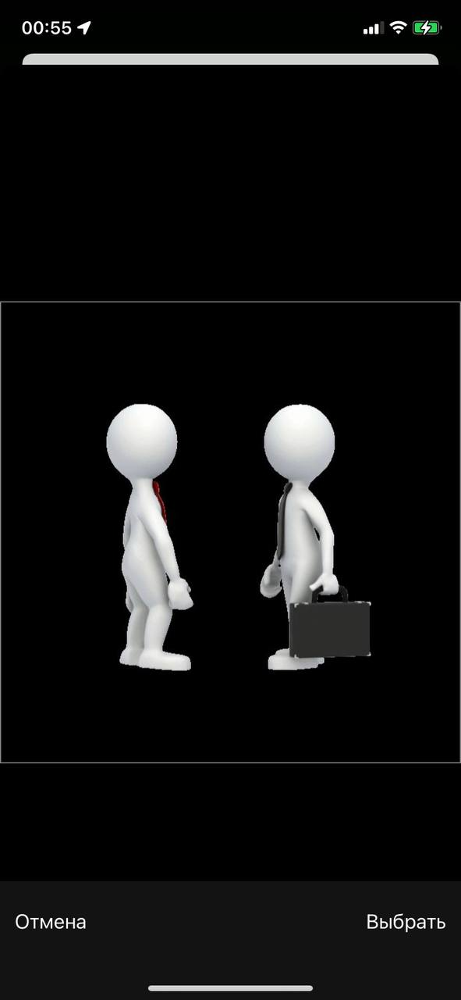
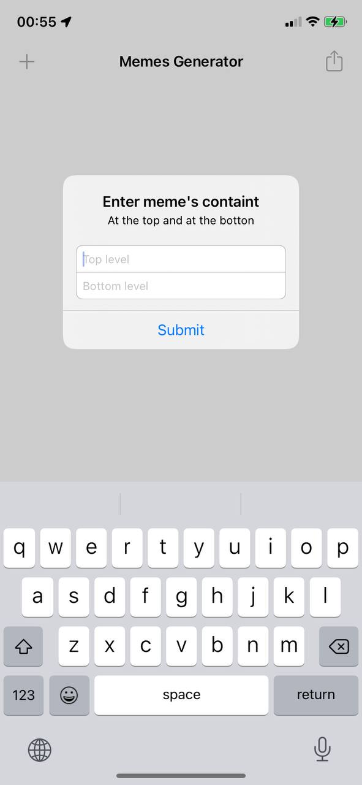
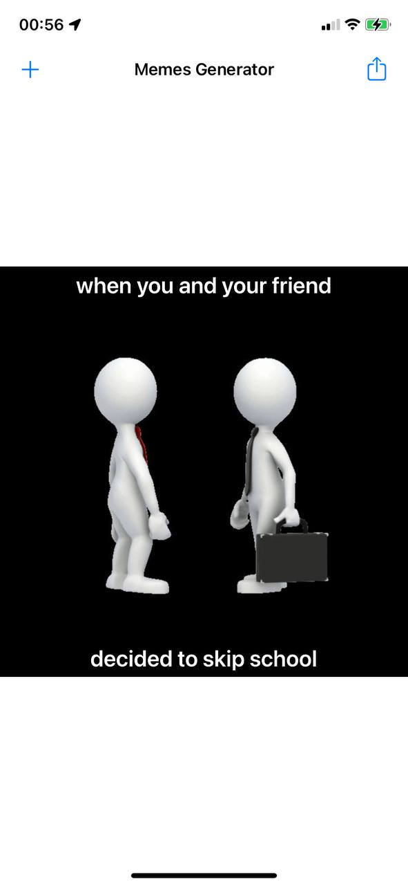
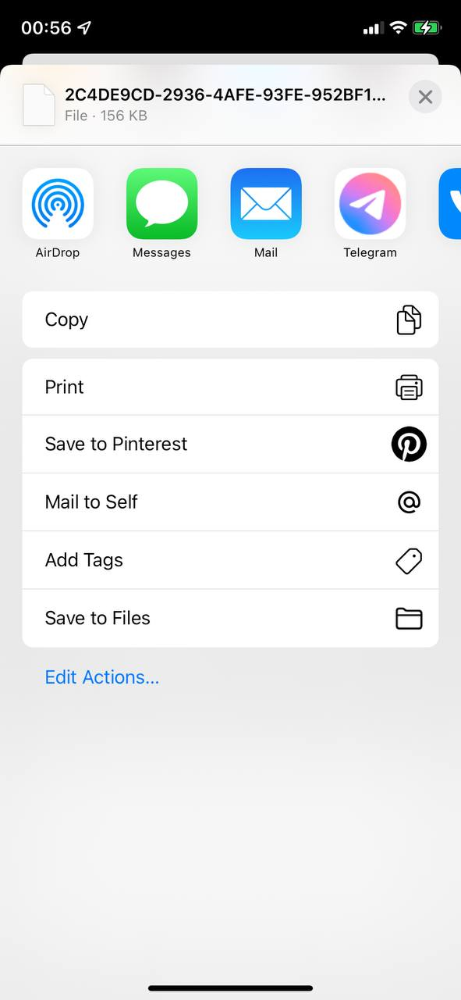

#  Milestone: Projects 25-27

Unaided iOS developing project in "100 days of Swift" challenge on website: www.hackingwithswift.com

In this project we created simple memes generator. User can take a photo by camera or select photo from photo library and add a text like two strings at the top of picture and at the bottom. We remember how to work with UIImagePickerController, practiced more with Core Graphic (for adding text on picture) and remember UIActivityViewController for sharing meme.

## Demonstration

We have view with two navigation item buttons. Left for adding picture, right for sharing.

When action button tapped:

Image selected, editing:

Set the top or/and buttom strings:

Ready meme:

Action sheet with actions for sharing meme:

