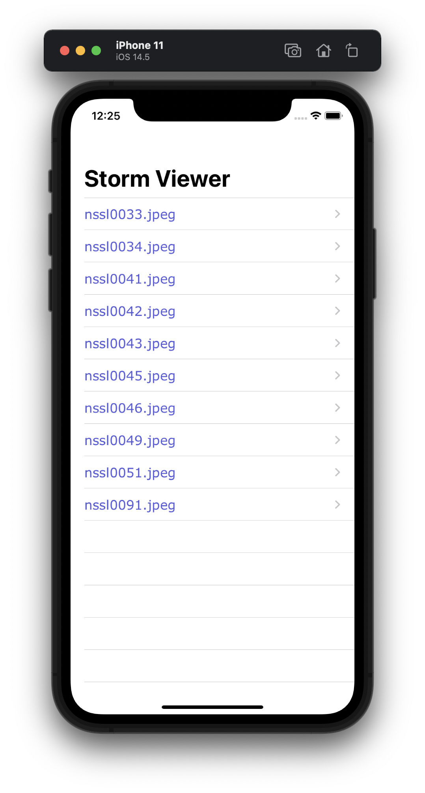

#  Project 1

First iOS developing project in "100 days of Swift" challenge on website: www.hackingwithswift.com

In this project we create mini photo album with photos from the National Oceanic and Atmospheric Administration (NOAA), which is a US government agency and thus produces public domain content that we can freely reuse. This is placed in file system of device. We met view controllers, storyboards and the FileManager class.

## Initial page with list of images:

## Showing image

