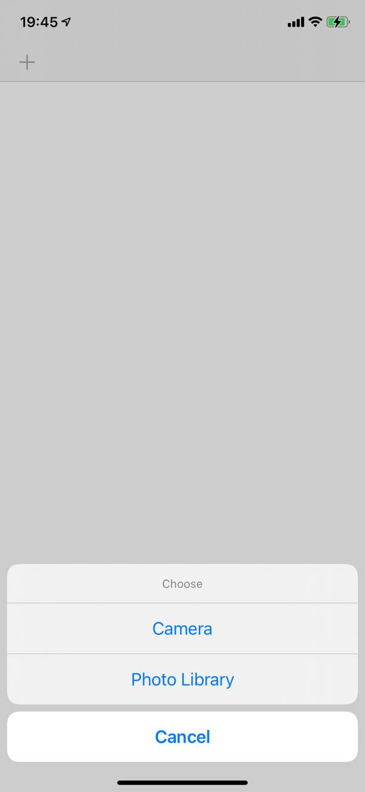
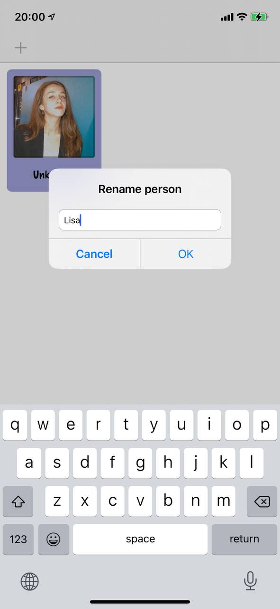
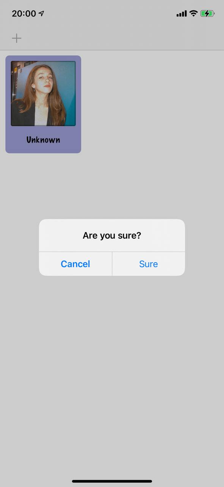

#  Project 10

In this project we created a simple app to help store names and images of people. We learned about UICollectionViewController, UIImagePickerController, NSObject, Data, and UUID.

## Demonstraition

Action Sheet Allert Controller with choosing camera (for devices with camera available) or photo library source for adding image.

Enabled editing mode.

Alert Controller with text field for input name.

Second Alert Controller embedden in first Allert controller to ask the user if he is sure changing name.

All screen with images and names in cells (using Collection View).

