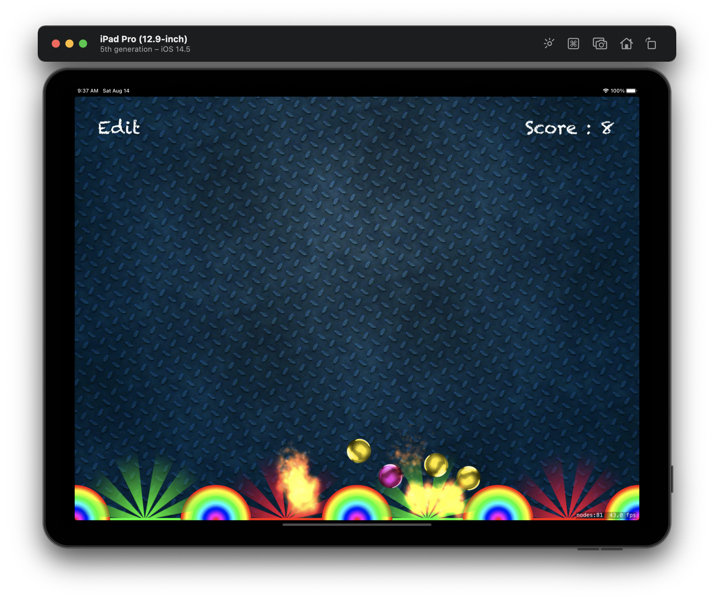
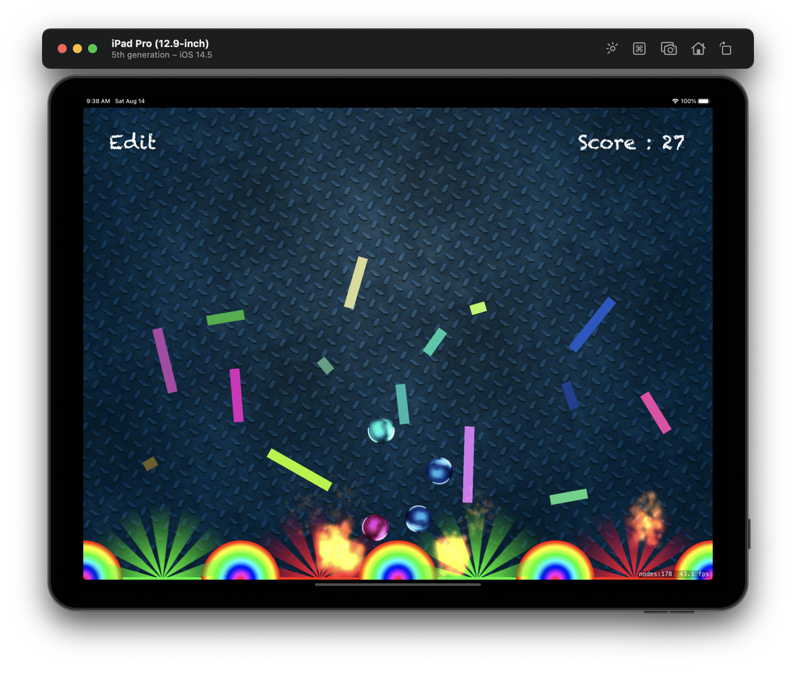

#  Project 11

The eleventh iOS developing project in "100 days of Swift" challenge on website: www.hackingwithswift.com

In this project we created simple 2D game like "Peggle" with using SpriteKit. We learned about SpriteKit, SKSpriteNode, SKPhysicsBody, UITouch, collision, bitmasks, SKAction, SKPhysicsContactDelegate, SKLabelNode, SKEmitterNode.

## Demonstration

General game screen with bounces, good or bad sectors and balls with random color at touched location. Also we have special effect like fire using SKEmitterNode when ball collision with some sector.

User can add obstacles that represent rectangle with random color, width and rotation.

