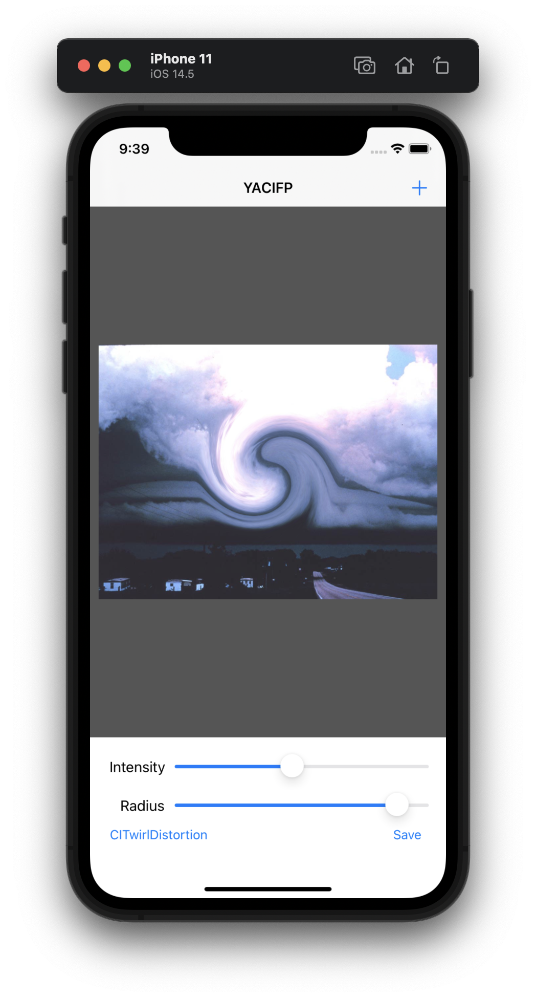
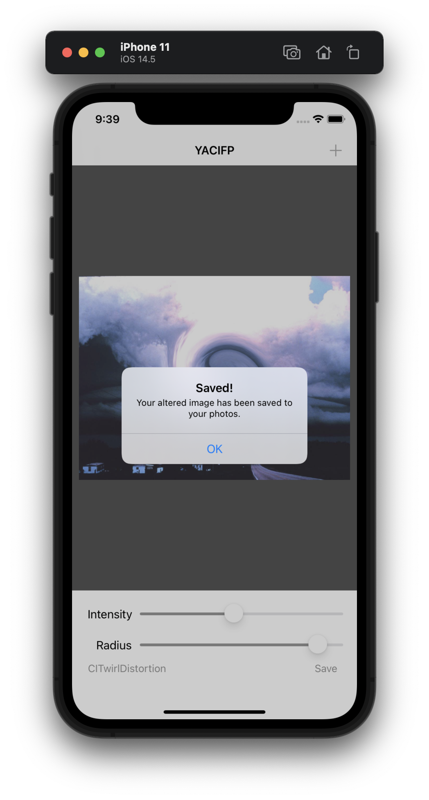
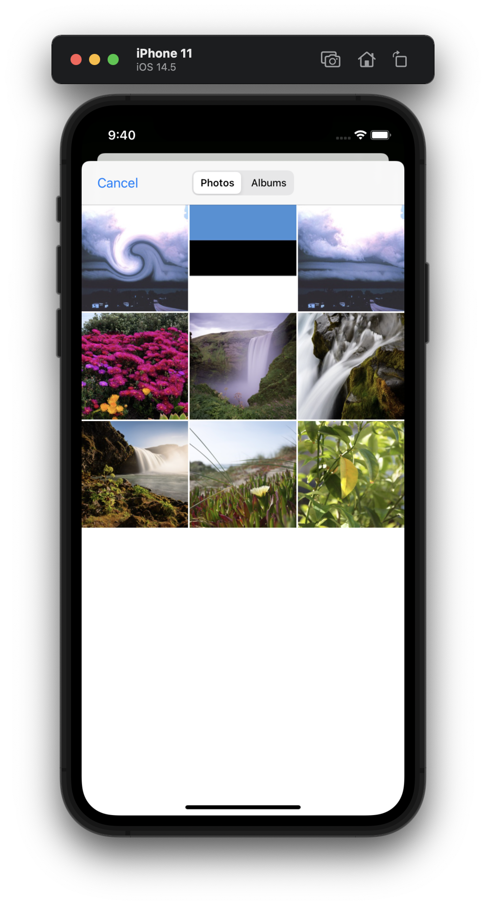

#  Project 13

The thirteenth developing project in "100 days of Swift" challenge on website: www.hackingwithswift.com

In these project we created simple editing images app that called "YACIFP" (like Yet Another Core Image Filters Program) and realized applying filters. We practiced and learned about Core Image, UISlider and working with iOS photo library.

## Demonstration

Screen with user's image from photo library, two sliders for changed intensity and radius properties for different filters.

After tapping on filter name we have Action Sheet with list of available filters.

Adding image from photo library. Also we can see that our previous processed image saved in photo library.

