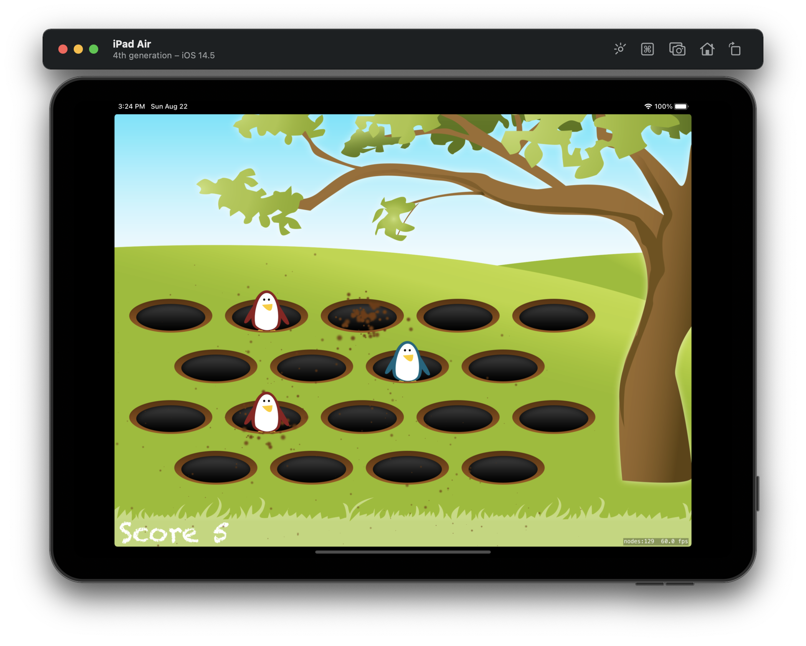
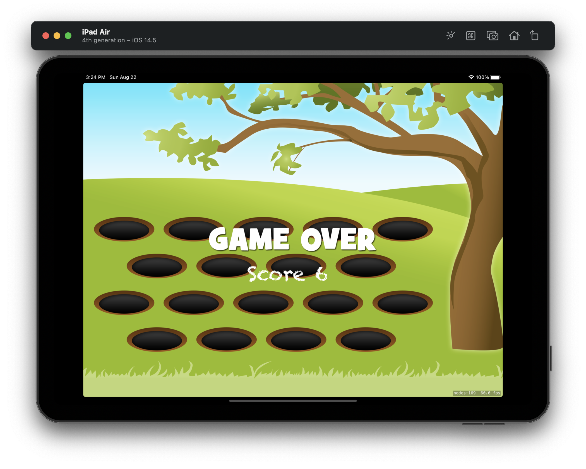

#  Project 14

The fourteenth iOS developing project in "100 days of Swift" challenge on website: www.hackingwithswift.com

In this project we created semple 2d game like "Whack-a-Pengium". We practiced and learned more about creating games with SpriteKit by Apple, in particular: SKCropNode, SKTexture, remember and precticed new in SKAction, created and applied particle emitter for SKEmmiterNode. Also we applied GCD for time delay.

The essence of the game is as follows:  penguins randomly come out of their burrows. The player needs to hit the "bad" (red) penguins, for this he gets points. If a player hits a "good" penguin (blue), he loses points on the contrary.

## Demonstration

General screen of the game:

Game Over screen with final score:

