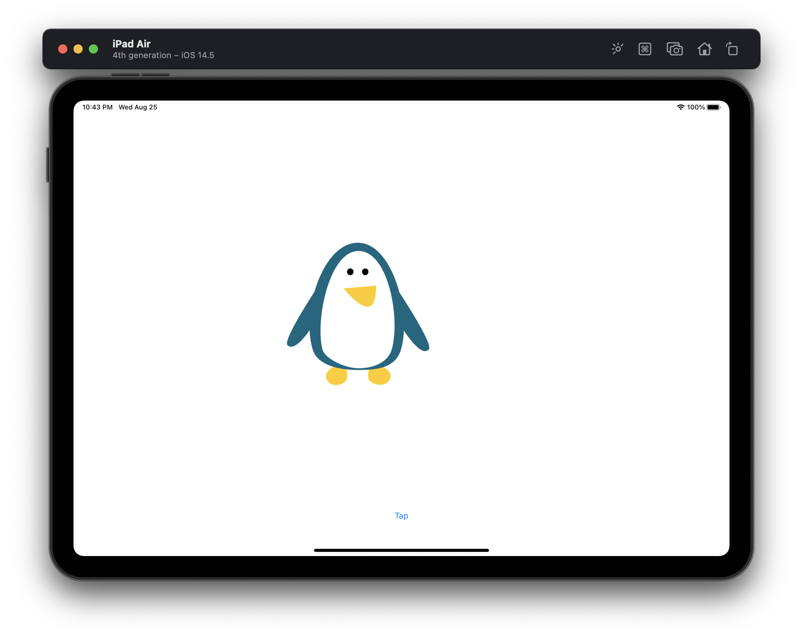
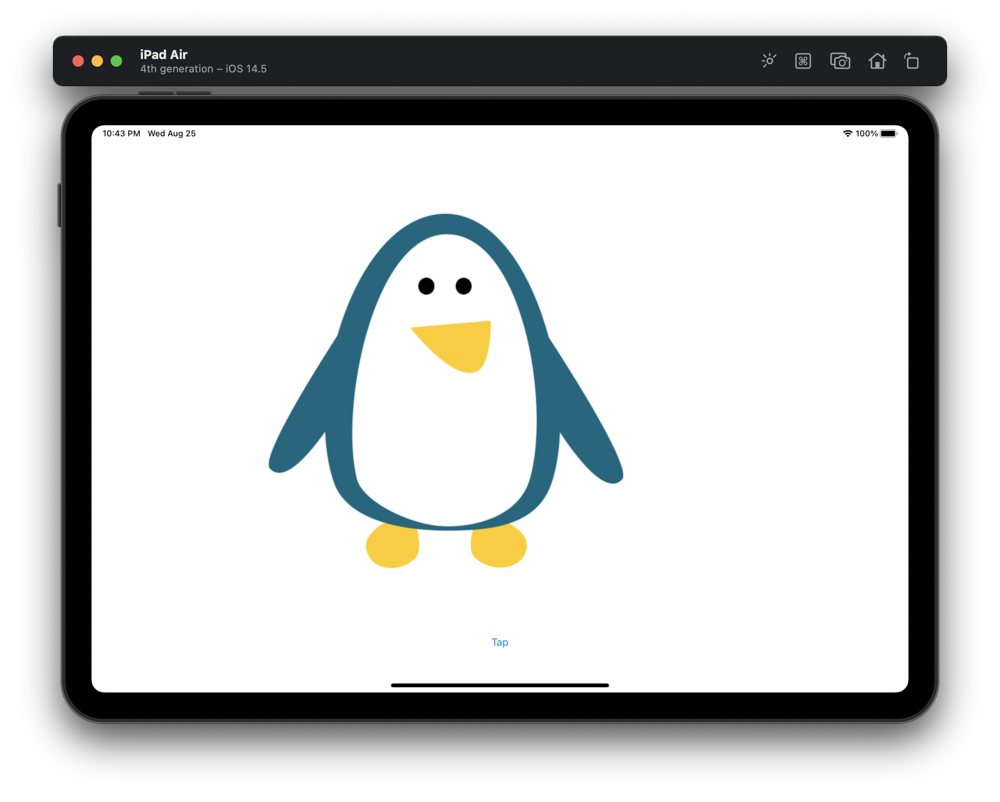
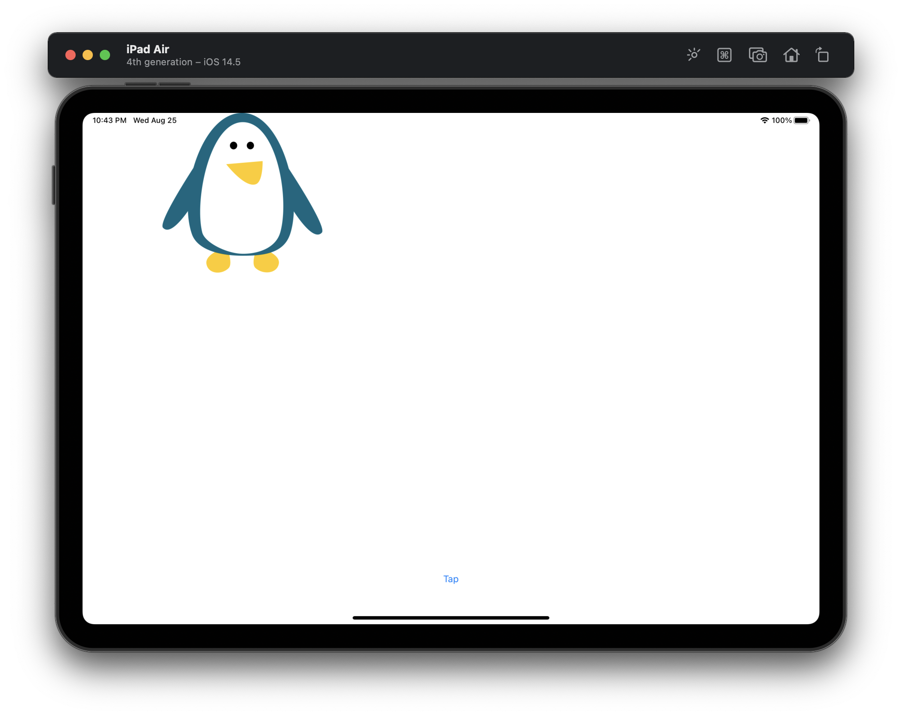
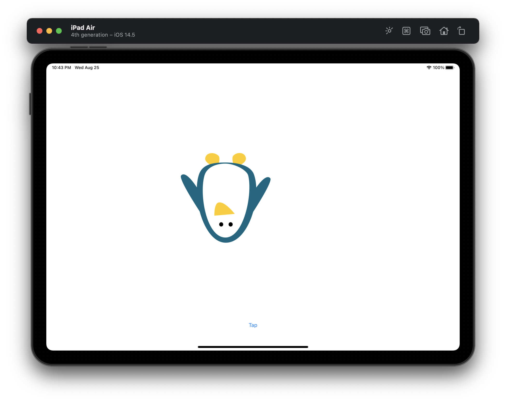
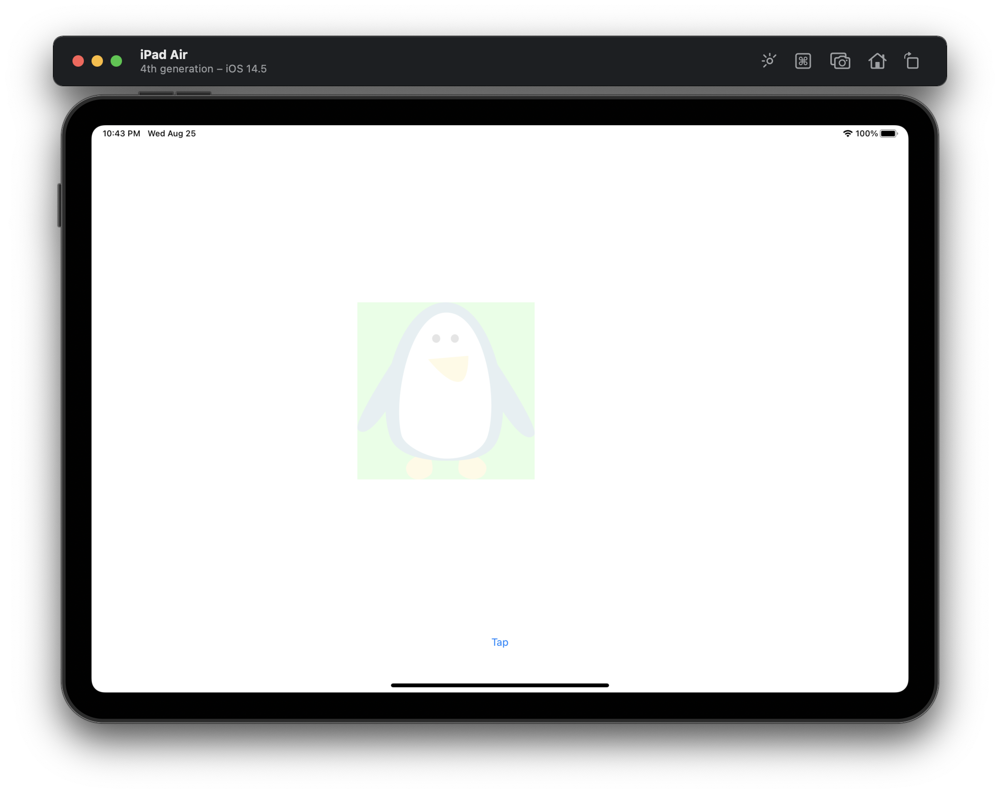

#  Project 15

The fifteenth iOS developing project in "100 days of Swift" challenge on website: www.hackingwithswift.com

In this project we practiced and learned Core Animation, in particular: the animate(withDuration:) method of UIView, spring animations, as well as alpha values and CGAffineTransform.

## Demonstration

On these screenshots we show five states of animation. When user tapped on the "Tap" button, the animation changes and the button disappears for a second. For animation we have applied affine transformations using CGAffineTransform.

### Default image:

### Double scale image:

### Moving across the view:

### Rotation by 180 radians:

### Set alpha on 0.1 (almost transparent) and change background color:

