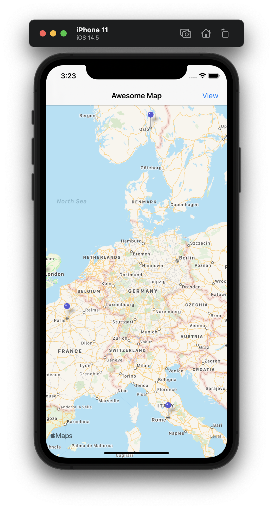
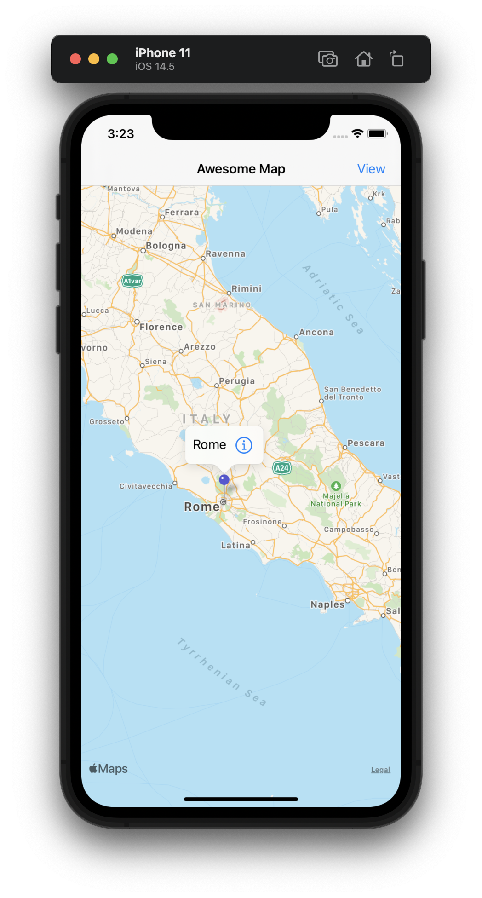
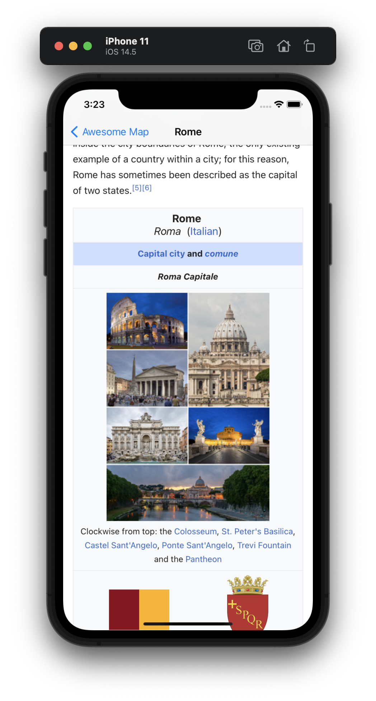
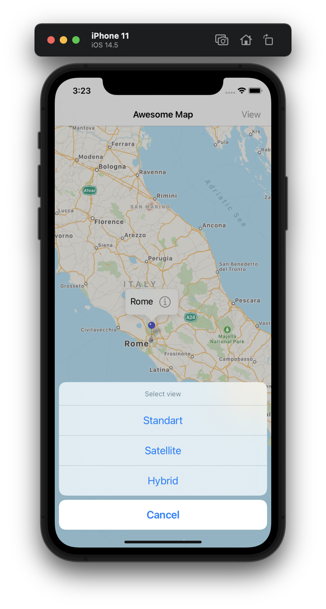
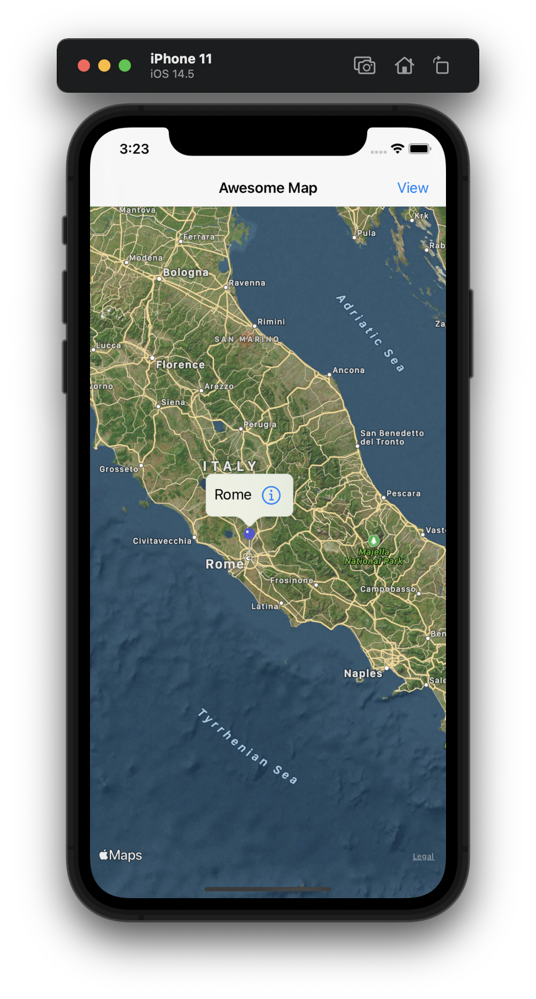

#  Project 16

The sixteenth iOS developing project in "100 days of Swift" challenge on website: www.hackingwithswift.com

In this project we created simple map viewer with any pinned capital cities. We learned about MapKit, MKMapView, MKAnnotation, CLLocationCoordinate2D and learned WebView for showing Wikipedia page about selected city. Also we realized some map view modes.

## Demonstration

General standart map view with annotations.

Annotation view.

Web View with page on Wikipedia.

Action view with differend map view modes.

Example of map view mode: hybrid.

