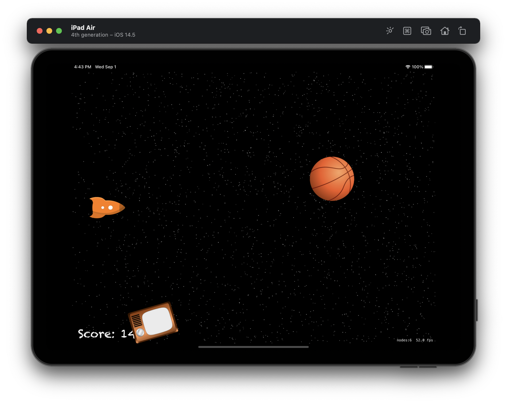

#  Project 17

The seventeenth iOS developing project in "100 days of Swift" challenge on website: www.hackingwithswift.com

In this project we created simple game with using SpriteKit. We remember how to works with SpriteKit, SKEmitterNode, SKSpriteNode, SKLabelNode, SKPhysicsBody and learned about pixel-perfect collision detection, Timer, linearDamping.

The essence of the game is as follows: our player will have to pilot a spaceship safely through a field of space junk. The longer they stay alive the higher their score will be, but they need to keep moving otherwise certain death awaits!

## Demonstration

User can moving player by continuous touching. Space junk is generating randomly, but faster over time.

