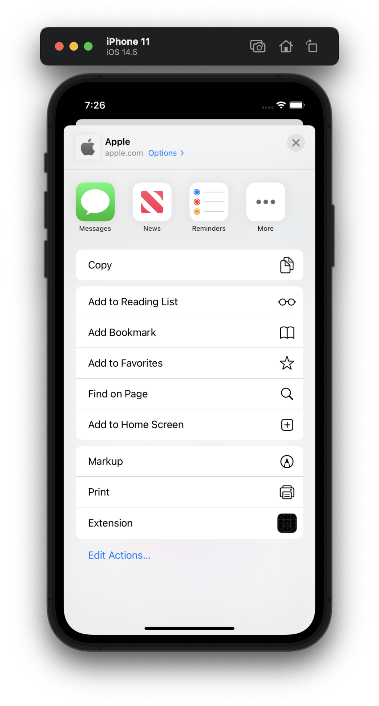
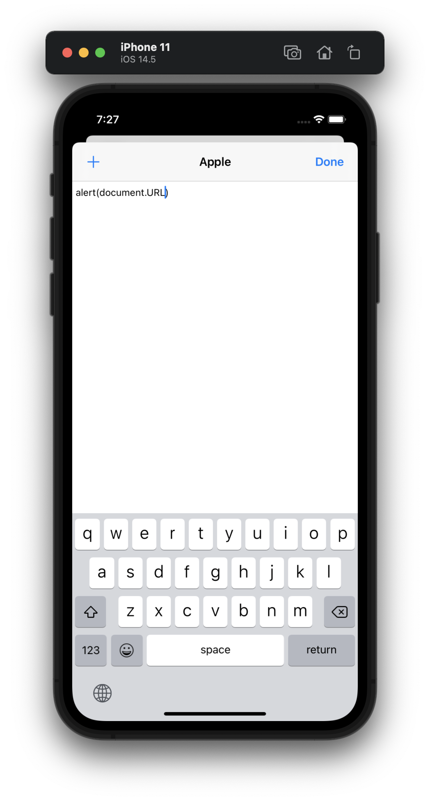
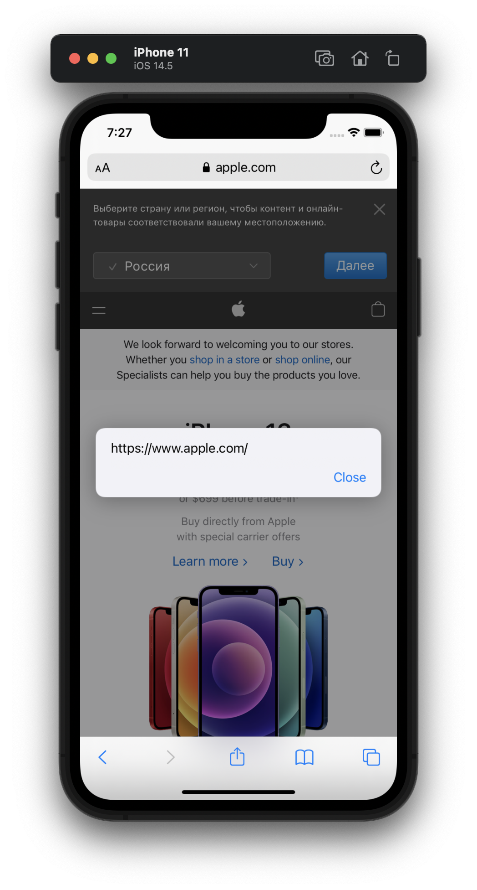
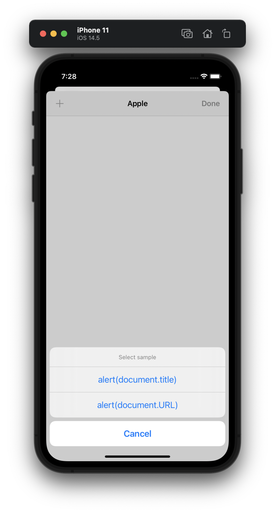

#  Project 19

The nineteenth iOS developing project in "100 days of Swift" challenge on website: www.hackingwithswift.com

In this project we created simple Extension for Safari browser app using NSExtensionItem, UITextView, NotificationCenter and UserDefaults.

The essence of our extension app is as follows: this is a Safari extension, which lets us embed a version of our app directly inside Safari's action menu, then manipulate Safari data in interesting ways. User can insert custom JavaScript code in Text View inside our extension. Then we’re going to send custom JavaScript code back to Safari and have it executed, giving our users the ability to manipulate web pages right on their phone.

## Demonstration

Our Extension is inside the Safari's Action menu.

Text View for input custom user's code (expected JavaScript).

The result of executing the entered code.

We save each entered user code in UserDefaults for each individual site. Each position of the list can be executed.

