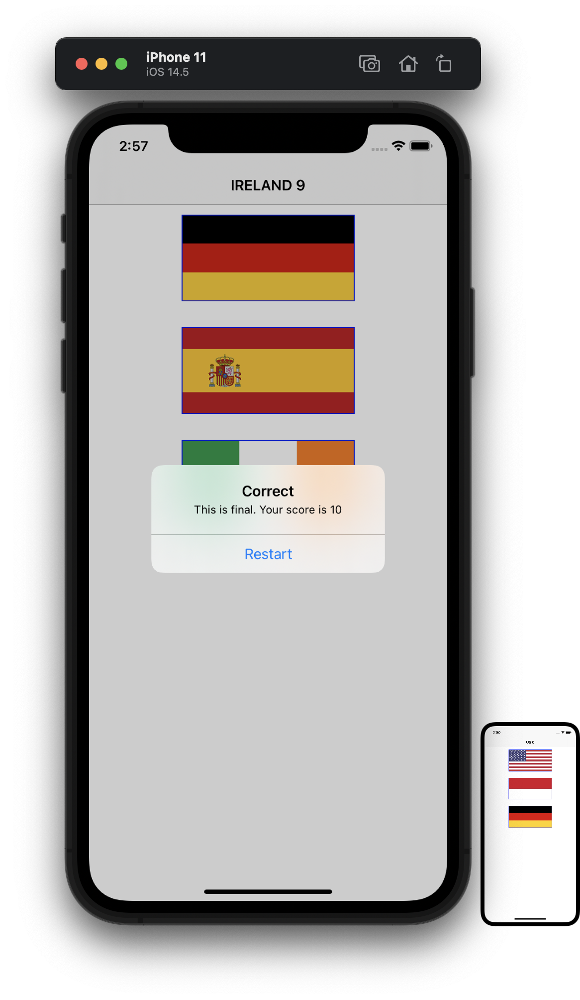

#  Project 2

Second iOS developing project in "100 days of Swift" challenge on website: www.hackingwithswift.com

In this project we create simple game like application. We used and learned asset catalogs, UIButton, CALayer, UIColor, UIAlert controller and more.

The essence of the game is as follows: there are three flags and user needs to select the right flag. Name of right flag written in the title of Navigation Bar. Game have scores and rounds. There are 10 rounds in total, then the game starts from the beginning.

## Demonstration

The start of game. There are three flags to guess and name of target country in the title of Navigation Bar.

Result of tapping on flag.

Finish.

