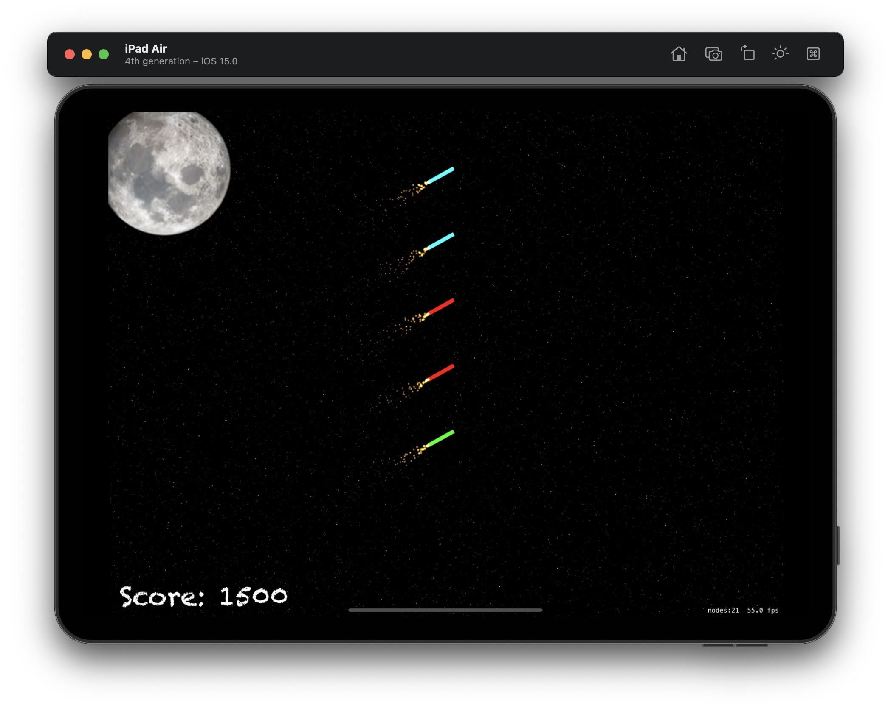

#  Project 20

The twentieth iOS developing project in "100 days of Swift" challenge on website: www.hackingwithswift.com

In this game we created simple 2D game using SpriteKit. We practiced and learned about UIBezierPath, SKAction.follow(), 'for case let' and some code to detect and respond the device being shaken.

The essence of the game is as follows: in this game players will need to select and detonate groups of fireworks. They'll need to touch fireworks of the same color, then shake their device to make them explode. Exploding five fireworks is worth 20x more points than exploding just one, hence the incentive to select groups by color!

## Demonstartion

General scene of the game.

