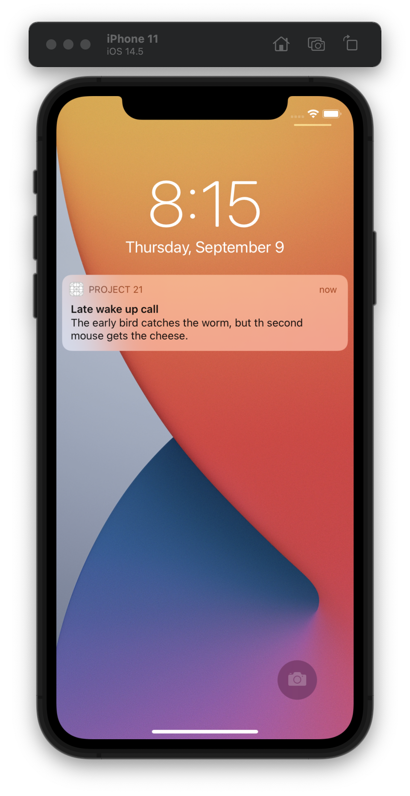

#  Project 21

The twenty-first iOS developing project in "100 days of Swift" challenge on website: www.hackingwithswift.com

In this project we created very simple one-page application with one target: learning notifications. We practiced and learned about Notification Center, UNUserNotificationCenter, requesting permission for notifications, the different kinds of notification trigger, UNMutableNotificationContent, notifications requests, UNNotificationCategory and UNNotificationAction, also DateComponents.

## Demonstration

General screen of app. It has two buttons: the first (left) one is for the permission request, the second one (right) - for launching sheduled notifications.

Permission request for notification sending.

Notification on lock screen.

Notification actions by notification categories.

Alert Controller when app opens by tapping on "Remind me later" notification action. Also we launching new notifications per year.

