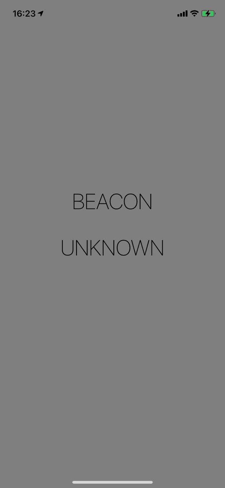
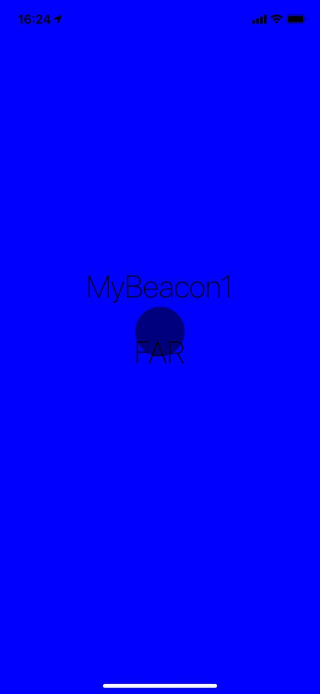
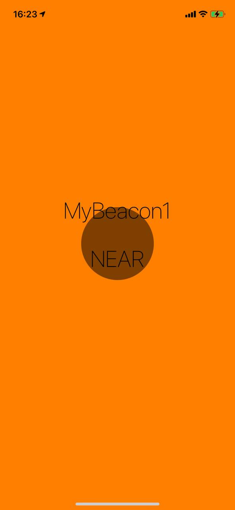
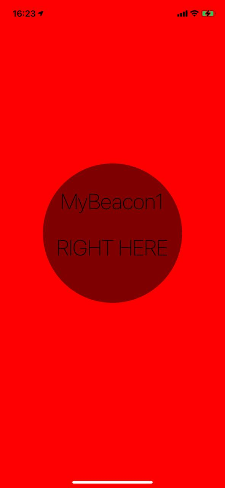

#  Project 22

The twenty second iOS developing project in "100 days of Swift" challenge on website: www.hackingwithswift.com

In this project we created simple beacons locator. We practiced and learned about Core Location, CLBeaconRegion and distance reading. We have three beacons for monitoring.

## Demonstration

Showing number of first nearest and distance to them, also we have circle which showing how far beacon is located.

