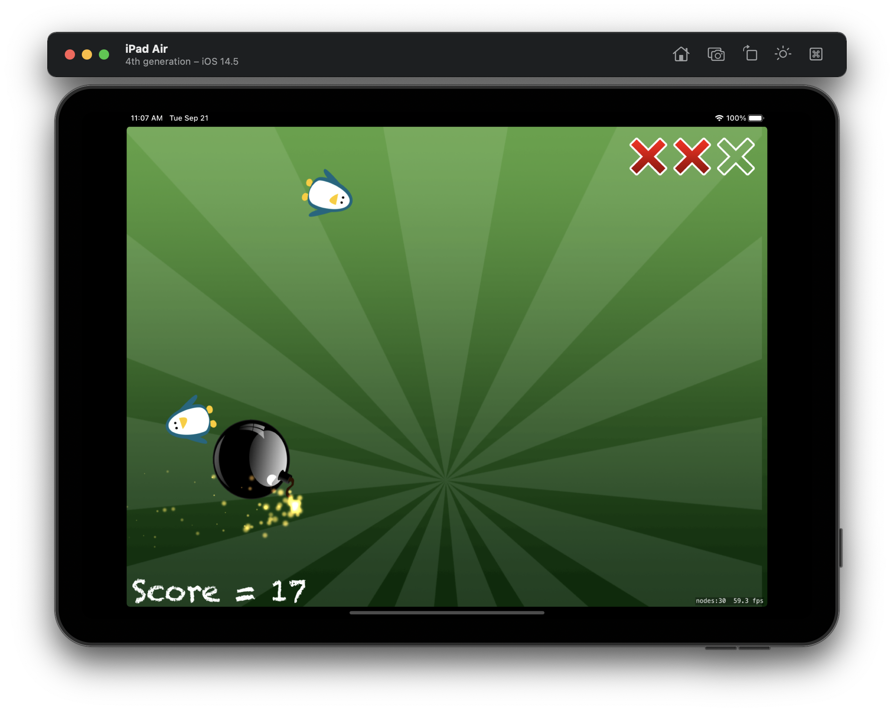

#  Project 23

Twenty third iOS developing project in "100 days of Swift" challenge on website: www.hackingwithswift.com

In this project we created a Fruit Ninja-style game. We remember  UIBezierPath, SKSpriteNode, physics, and more. Also we practiced and learned about SKShapeNode, touchesEnded(), AVAudioPlayer, physics speed, CaseIterable, removeFirst() and action groups.

The essence of the game is as follows: the game is arranged according to the "Fruit Ninja" type. Enemies (in the form of penguins) and bombs fly into the playing field. It is necessary to cut the penguins and NOT touch the bombs. If you cut the bomb - the game is over, if you miss three penguins - the same. There is also a score of points: one ordinary penguin - one point, one fast penguin (there is one) - 3 points. The game becomes more complicated over time, the enemies fly out faster.

## Demonstration

