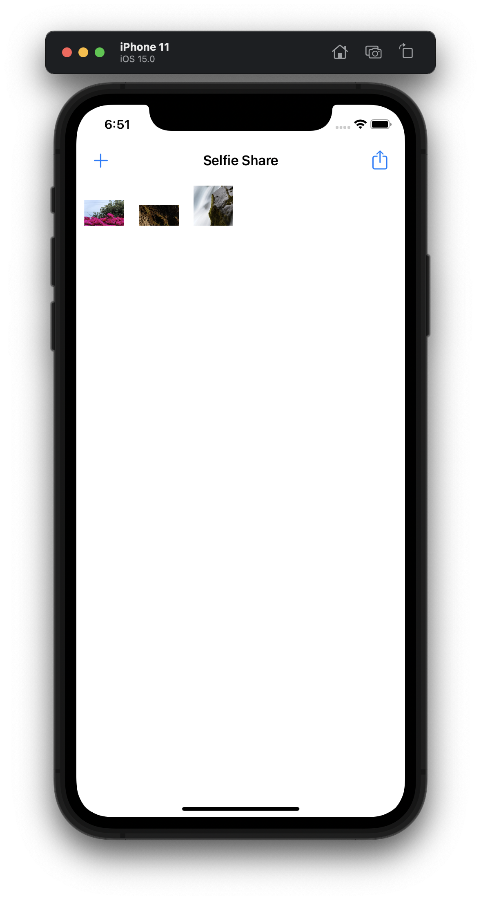
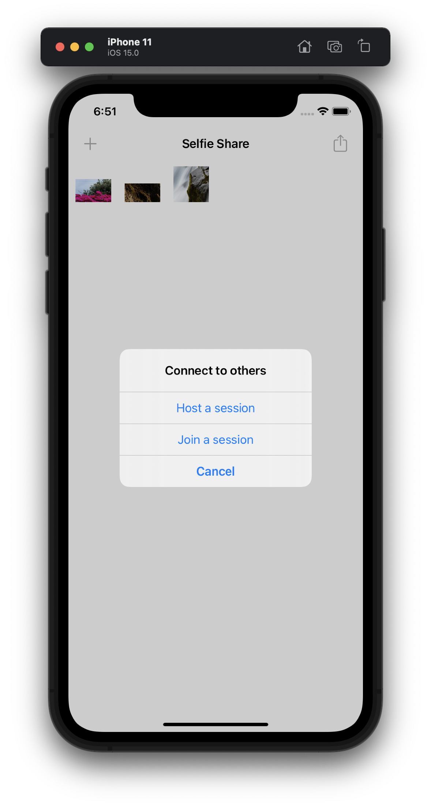
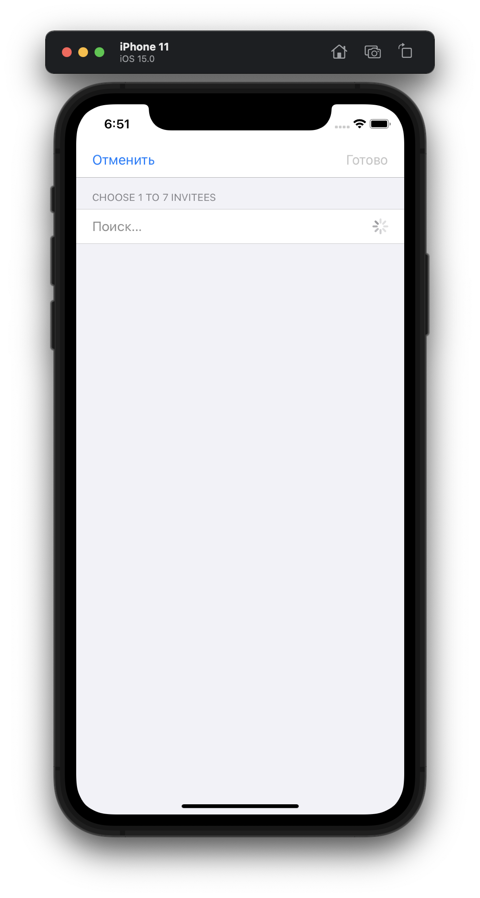
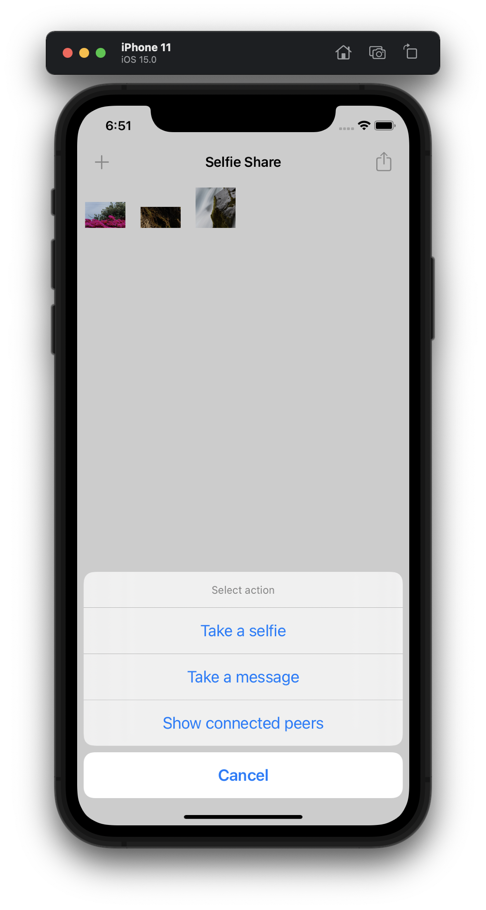
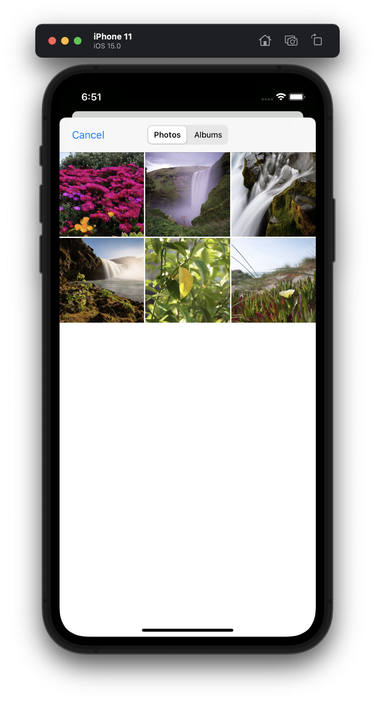
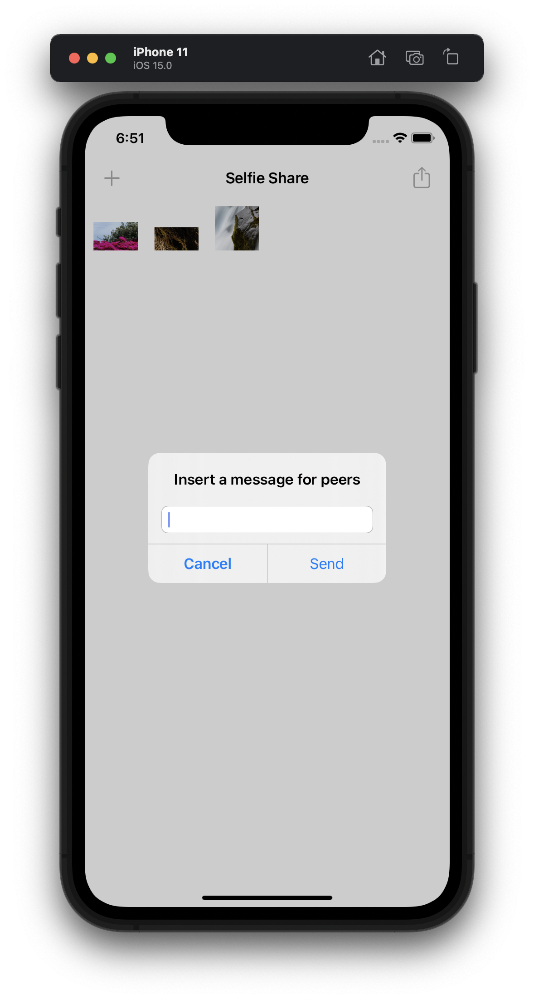
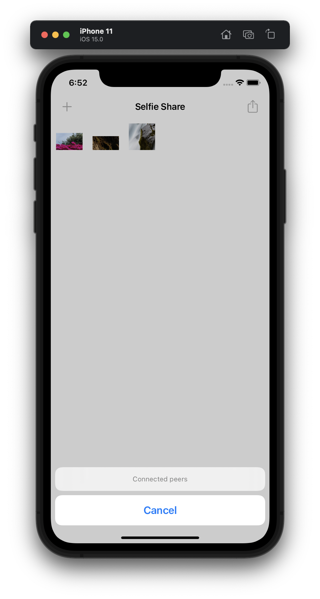

#  Project 25

The twenty-fifth iOS developing project in "100 days of Swift" challenge on website: www.hackingwithswift.com

In this project we created simple app for sharing selfie and messages by multipeer network. We practiced and learned about peer to peer networking, MultipeerConnectivity and it's MCSession, MCPeerID, MCAdvertiserAssistant MCBrowserViewController classes for managing multipeer connectivity.

## Demonstration

General screen with our and peer's selfies. Also we have buttons for creating and join to sessions (left) and for selecting additional action: take a selfie, send message and show connected peers.

Buttons for creating and join to sessions.

Searching a session...

Buttons for selecting additional action: take a selfie, send message and show connected peers.

ImagePicker for selecting image.

TextField for writing a message.

Listing connected peers to current session. Unfortunately, I haven't been able to link a couple of devices on the new version of iOS yet.

