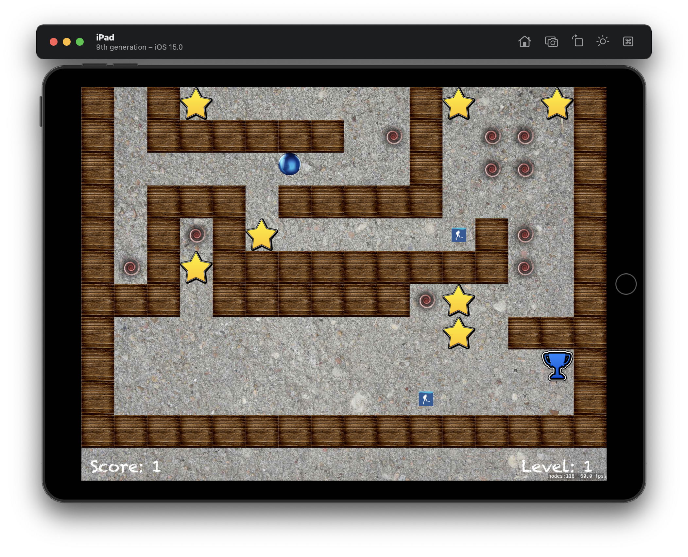

#  Project 26

The twenty-sixth iOS developing project in "100 days of Swift" challenge on website: www.hackingwithswift.com

In this project we created awesome simple game with accelerometer controller. We practiced and learned about reading the accelerometer using Core Motion and combining bitmasks using "|", how to load a game level from a file and how to create custom physics bitmasks, while also getting some practice with fatalError(), SKAction.

The essence of the game is as follows: this is a rolling ball game for iPad, using the accelerometer – you tilt your device, and the balls rolls in that direction, hopefully avoiding holes as you go.

## Demonstration

