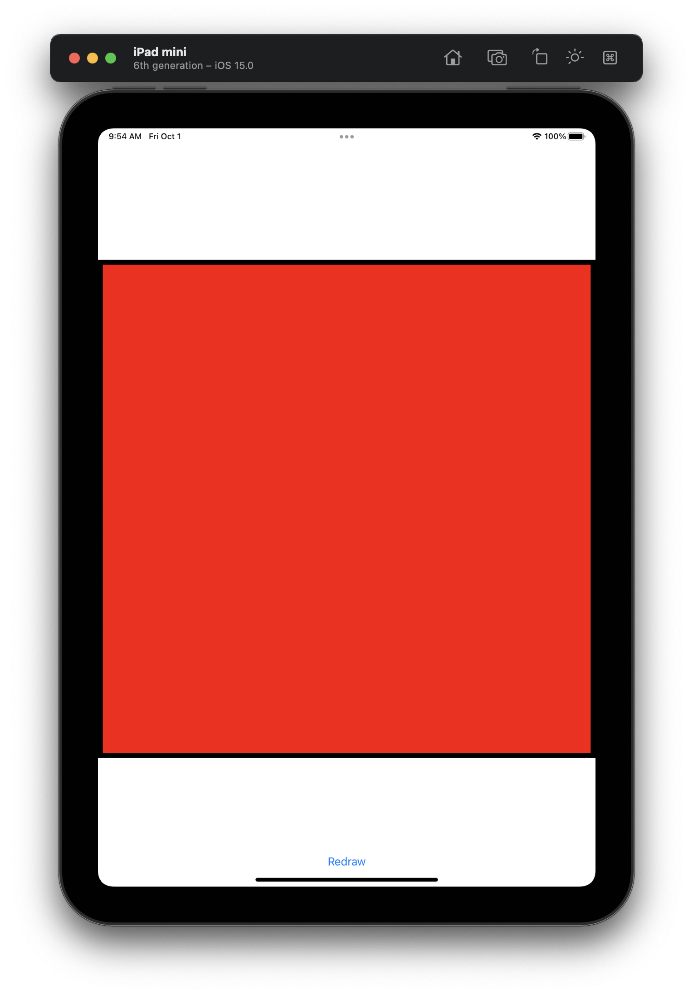
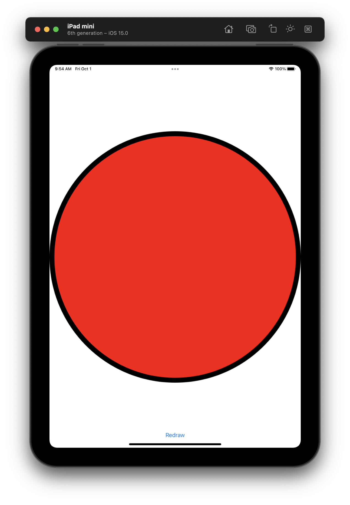
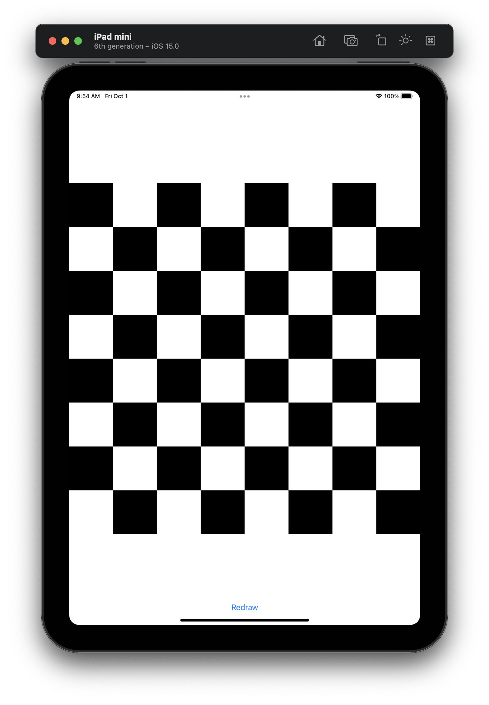
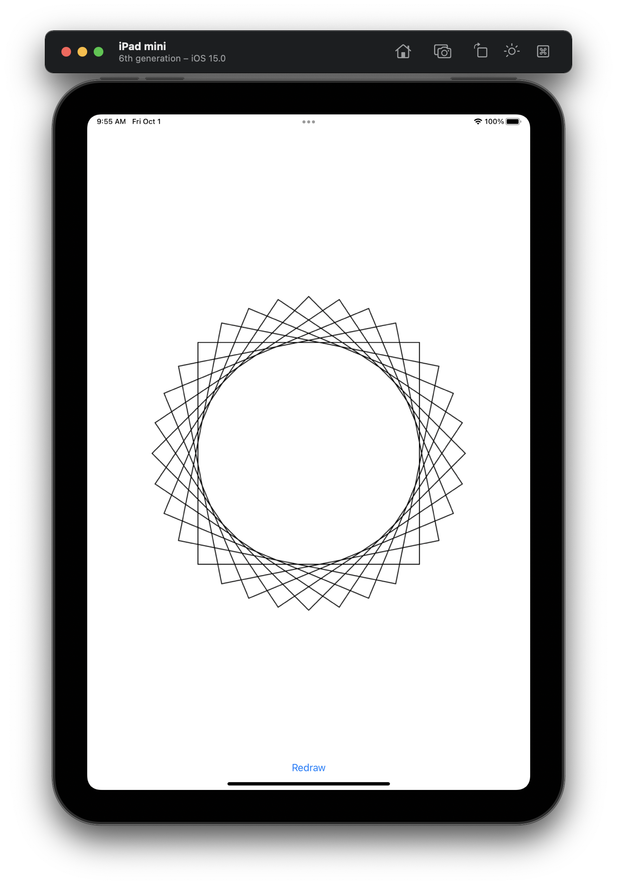
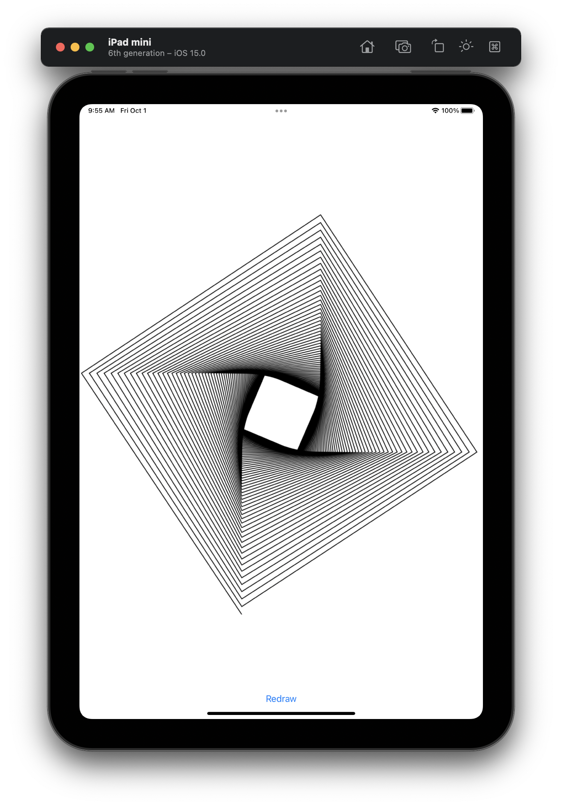
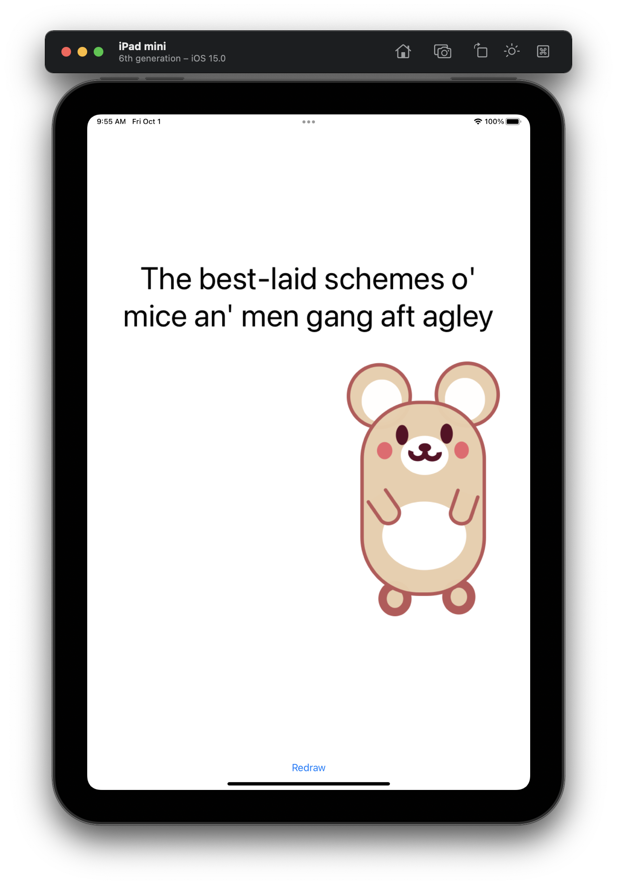
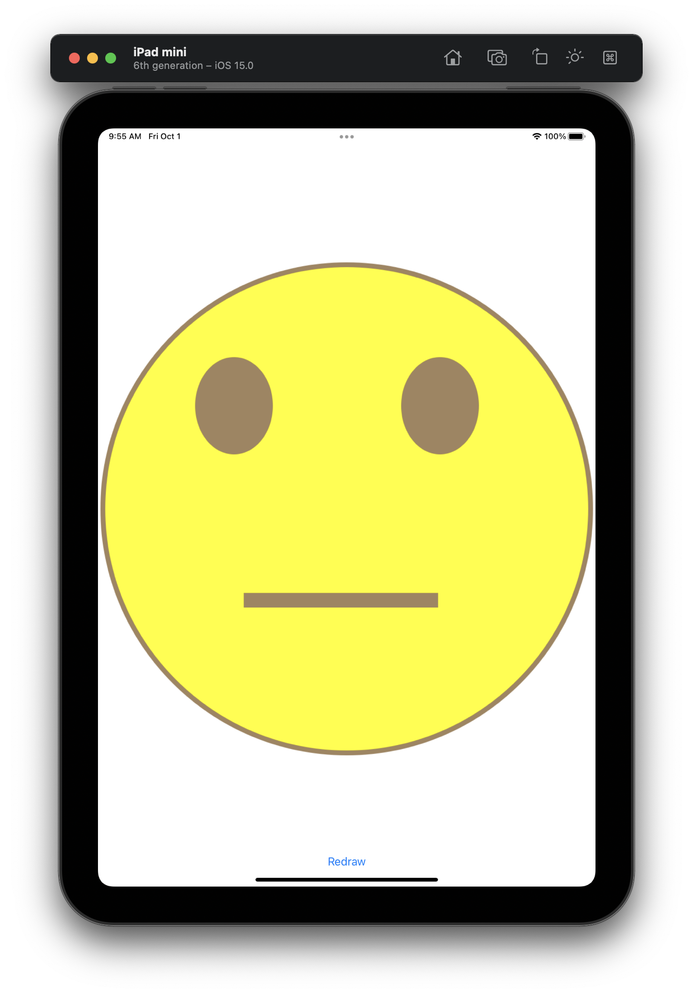

#  Project 27

The twenty-seventh project iOS developing project in "100 days of Swift" challenge on website: www.hackingwithswift.com

In this project we practiced and learned about Core Graphics UIGraphicsImageRenderer, drawing fills and strokes, and insetting a CGRect, while also getting more practice with NSAttributedString. We have several different types of core graphics creating images in code: simple rectangle, ellipses and checkboards, transforms and lines, images and text.

## Demonstration

Simple rectangle:

Ellipse:

Chessboard:

Transforms and lines:

Image and text:

Homework: Emoji

