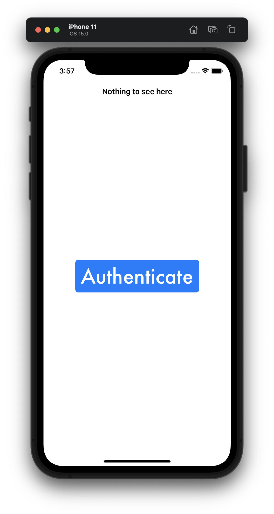
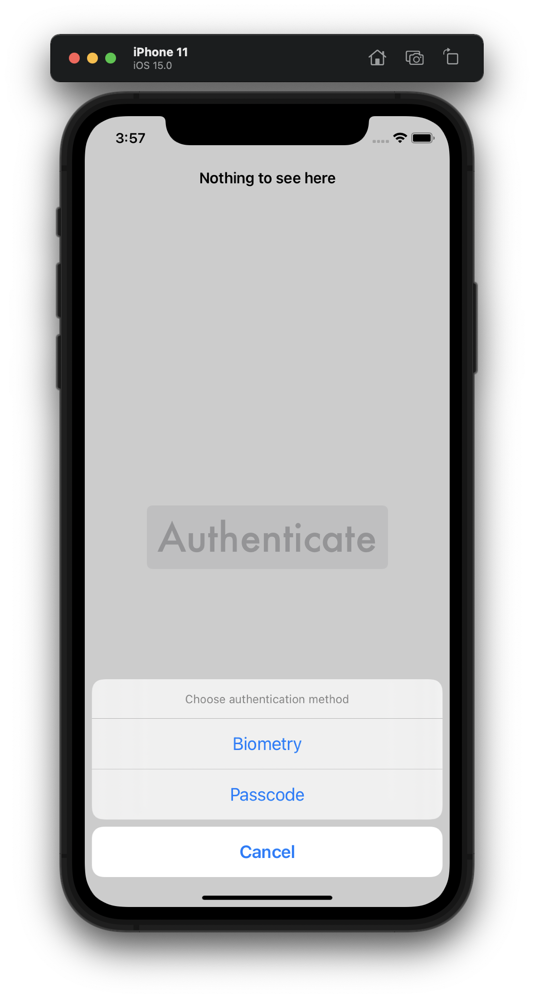
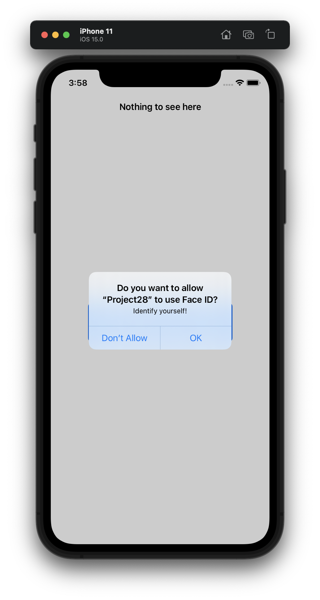
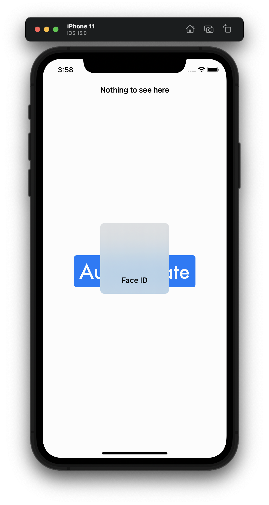
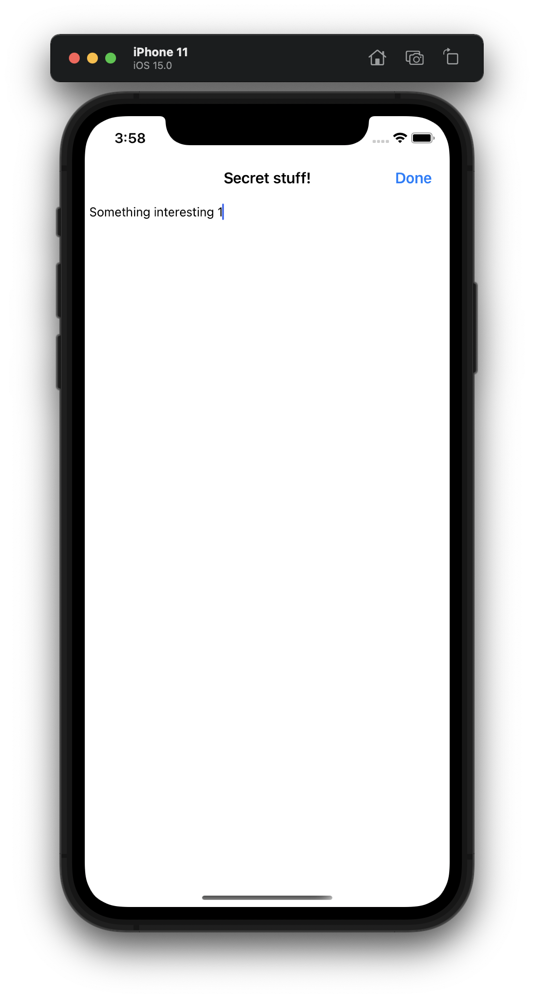
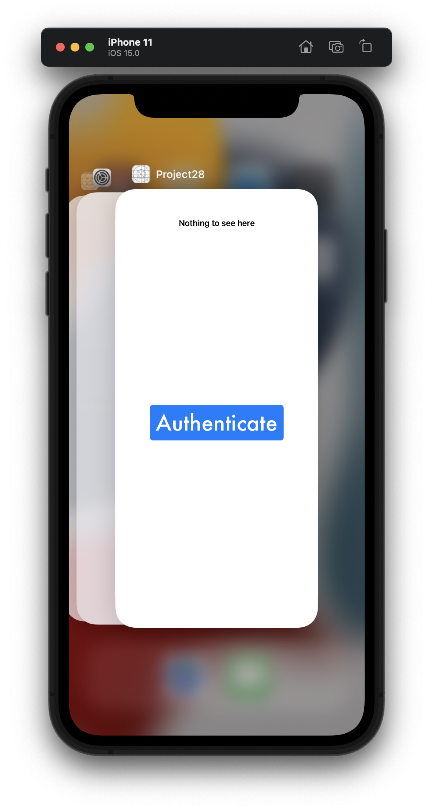
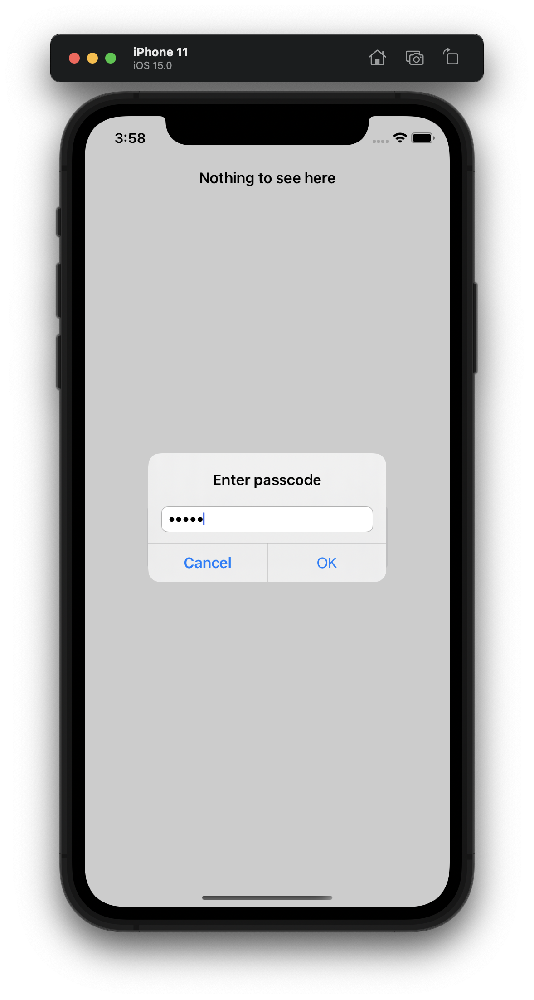
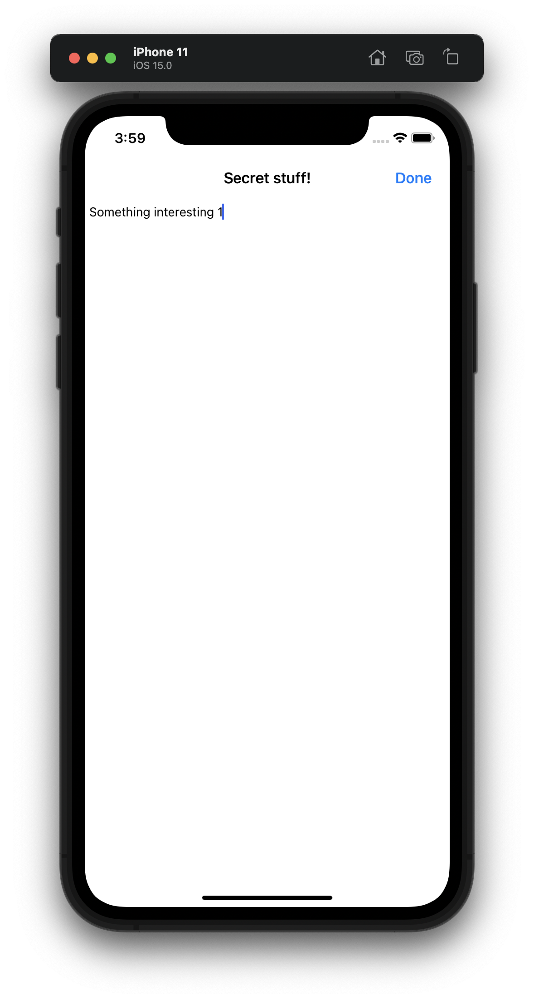

#  Project 28

The twenty-eighth project iOS developing project in "100 days of Swift" challenge on website: www.hackingwithswift.com

In this project we created simple secure text editor with biometry (FaceID/TouchID) or passcode access. Also we store notes and passcode system in Keychain - secure encrypted space for our app. We practiced and learned about the LocalAuthentication framework and the iOS keychain.

## Demonstration

First screen with button for enter by authentication.

Action sheet for shoosing authentication method.

Request rights to use biometrics for authentication in the application.

Face ID is activated.

Tap secret stuff 😏

Double-tap the home button or hide the app. The text field is hidden and the text is written to the Keychain.

A passcode login attempt.

A note saved in Keychain has opened by passcode for editing.

