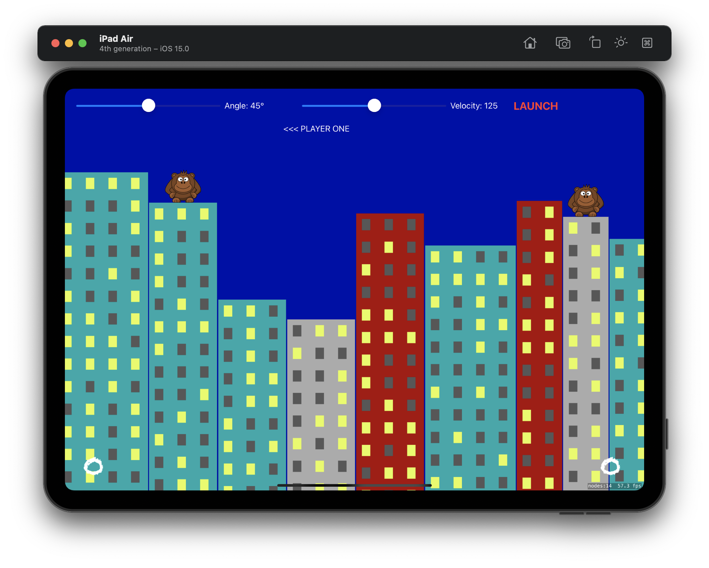
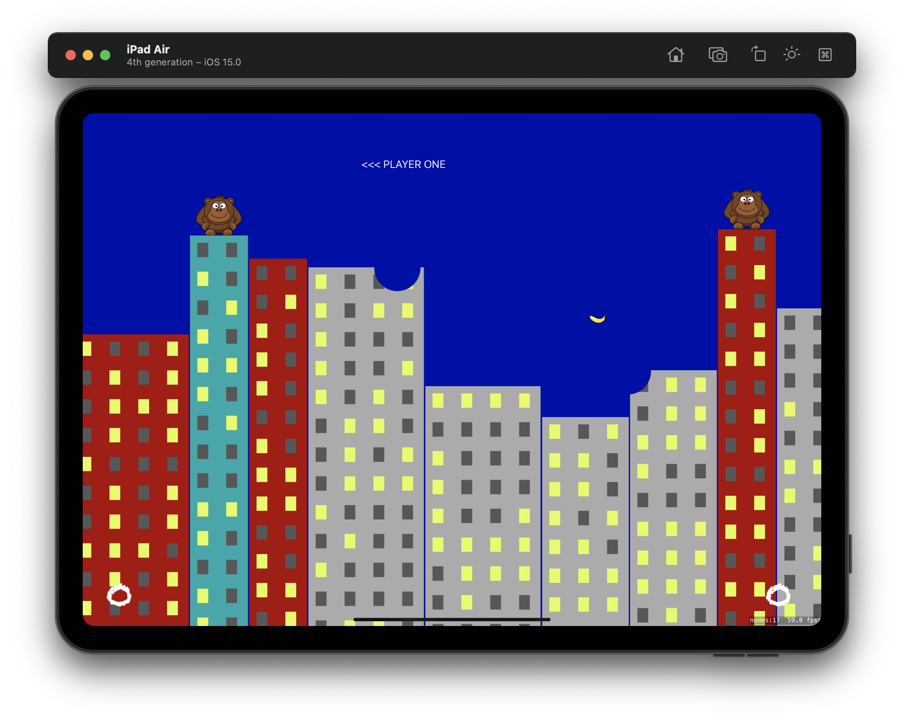
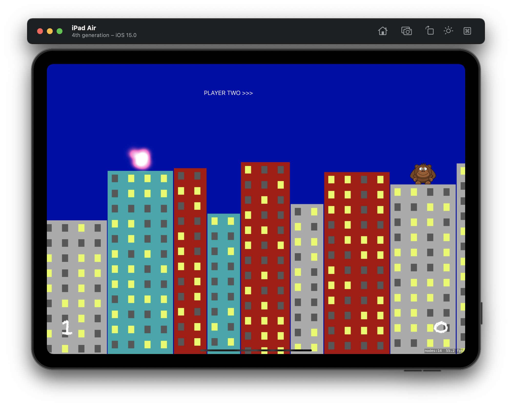
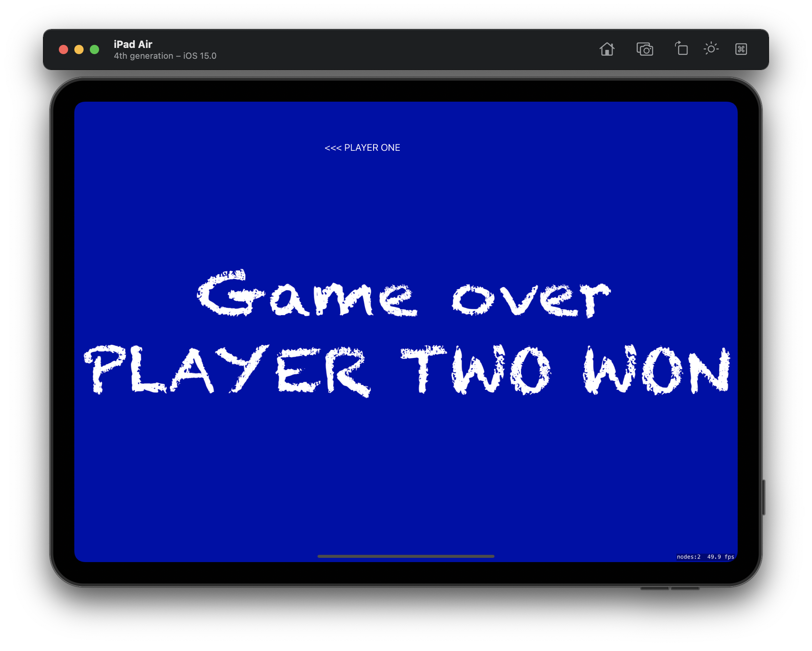

#  Project 29

The twenty-ninth project iOS developing project in "100 days of Swift" challenge on website: www.hackingwithswift.com

In this project we created SpriteKit game together with UIKit. We practiced and learned how to generate a scene dynamically, how to connect SpriteKit and UIKit.

The essence of the game is as follows: as game called Gorillas. It pits two players against each other, both standing on high-rise buildings and both flinging exploding bananas at each other using physics.

## Demonstration

Game scene.

Launching the cartridge and damaged houses.

Hitting the player with a banana and triggering the explosion effect using SKEmitter.

Game Over. The game ends when one of the players gets three points.

