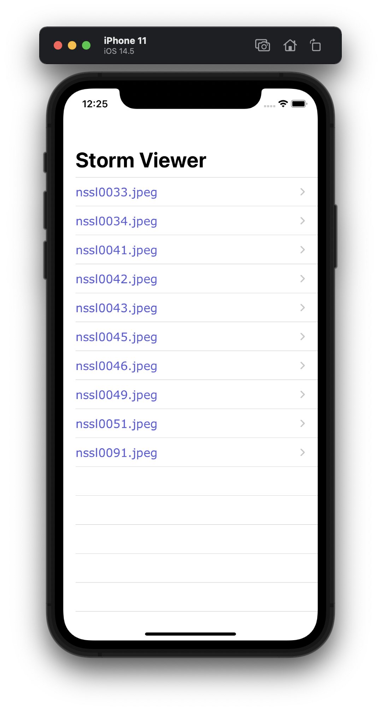
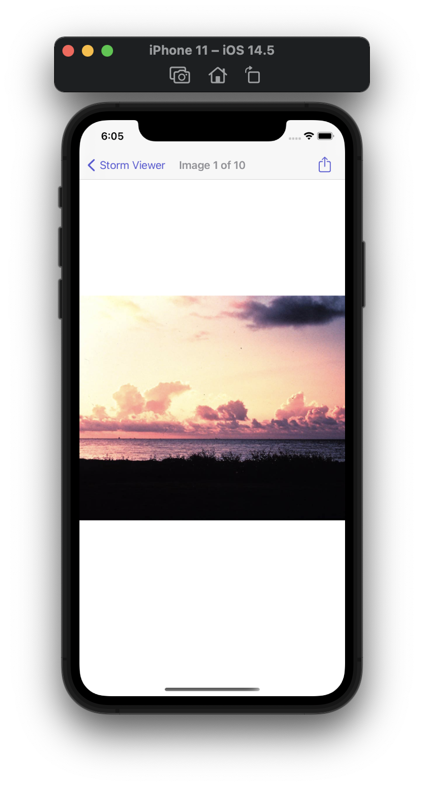
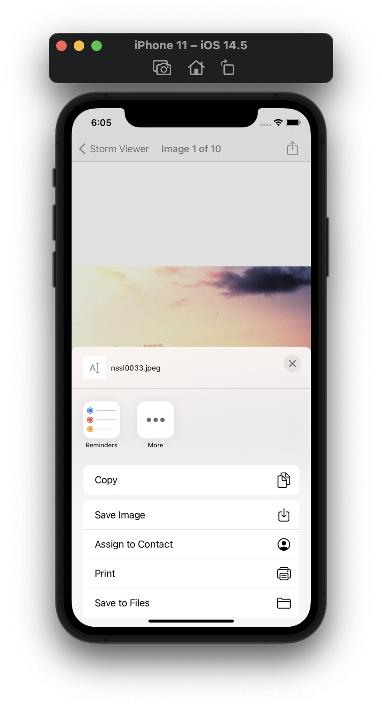

#  Project 3

Third iOS developing project in "100 days of Swift" challenge on website: www.hackingwithswift.com

In this project we modified [Project 1](https://github.com/elfortitude/100_Days_of_Swift/tree/main/Project1) and learned UIBarButton and UIActivityViewController. Added the ability for users to share images with their friends.

## Demonstration

Start screen from [Project 1](https://github.com/elfortitude/100_Days_of_Swift/tree/main/Project1):

View image with the button for sharing on the right in Navigation Bar:

Ativity View Controller window for sharing, ssve images etc.:

