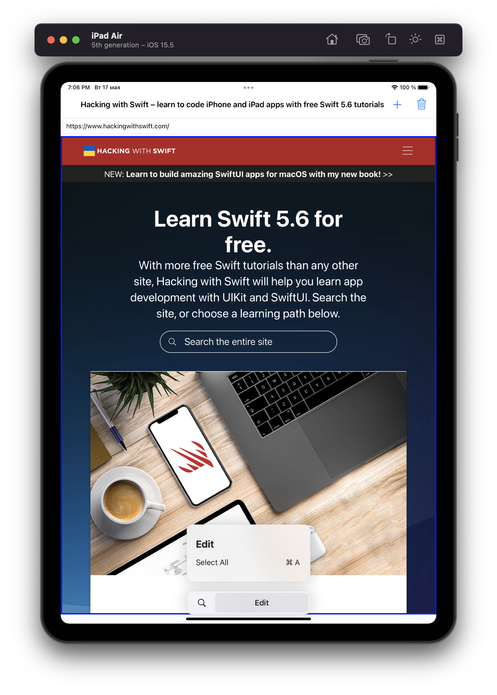
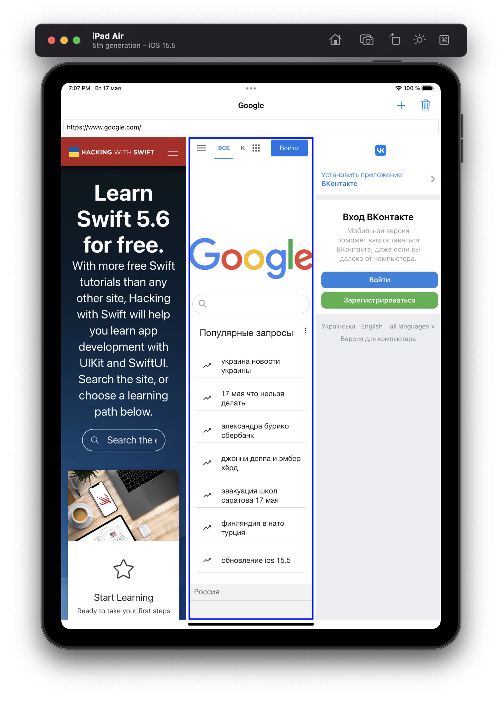
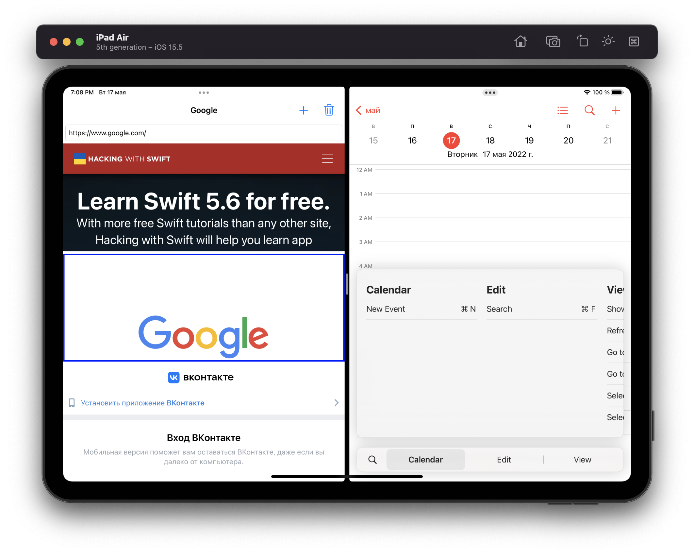

# Project 31

The thirty-first iOS developing project in "100 days of Swift" challenge on website: www.hackingwithswift.com

In this project we created simple "Multibrowser" app for showing ipad multitasking. It shows one or more web views that the user can simultaneously browse. We learned UIStackView, iPad multitasking (Split View). Also remembered WebKit and UIGestureRecognizer (for managing active web view).

## Demonstration

General screen with one WebView. It has Text Field for URL, "+" button for adding yet another view and "Trash" button for deleting view.

Case with several web views. We have vertically stacked web views.

Case with Split View. If we have equally less than or equal to than 1/2 of screen space, we could arrange its web views horizontally. This is done using the traitCollectionDidChange() method, which gets called automatically when our app's size class has changed. 
