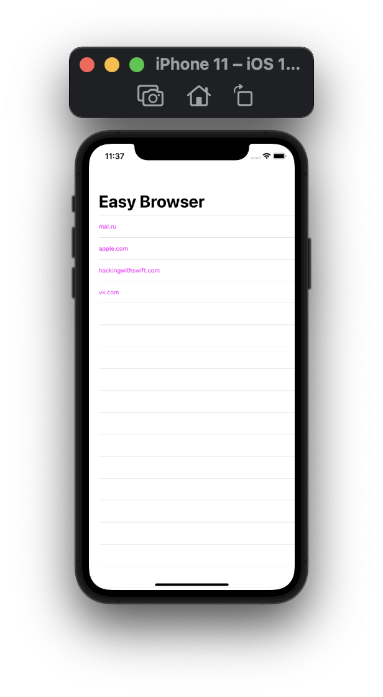
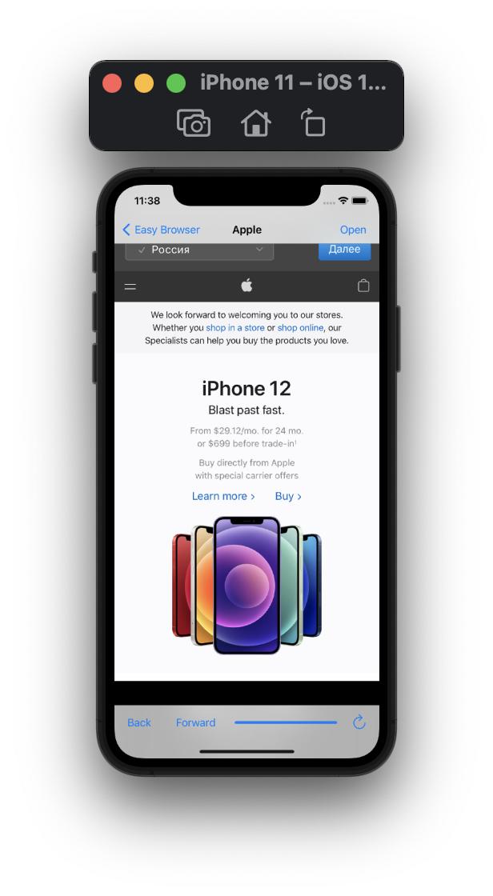
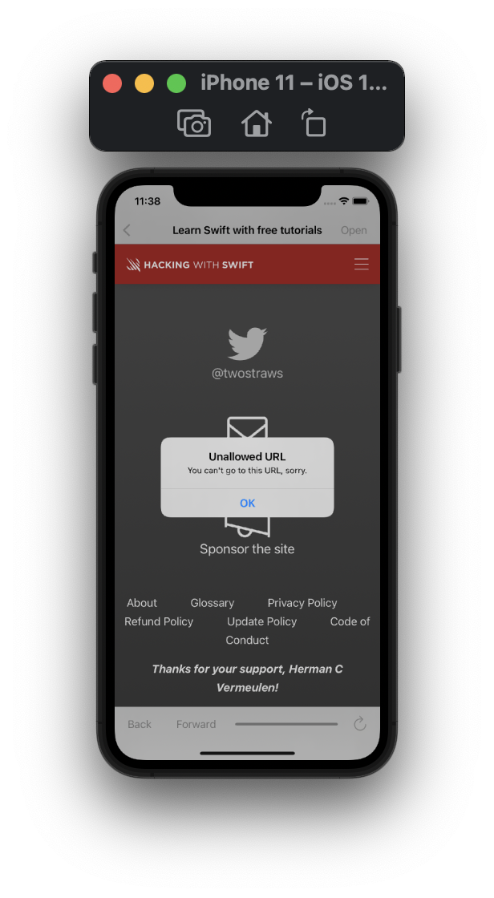

#  Project 4

Fourth iOS developing project in "100 days of Swift" challenge on website: www.hackingwithswift.com

In this project we create simple web browser that open some URL from allowed array. We remembered UITableViewController and UIAlertController, as well as learned and practiced loadView(), WKWebView, delegation, URL, URLRequest, UIToolBar, UIProgressView, KVO and refactoring.

## Demonstration

Start view of app is a table view with list of allowed websites.

User can select website and then it will be open in new view. There are ability go back or forward pages, progress bar that show process of loading page, refresh page and "Open" page which contains list of allowed websites as well as start view of app.

If a user tries to follow a link that is not in the allowed list, he receives a warning and the action is not taken.

