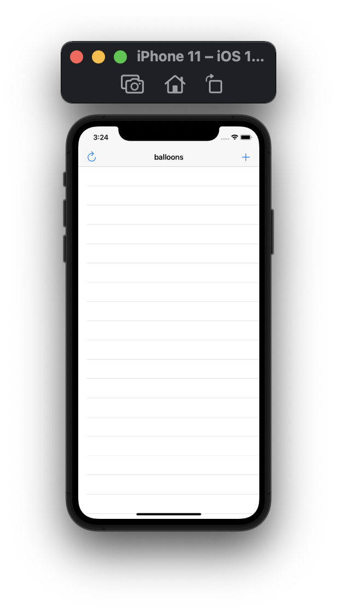
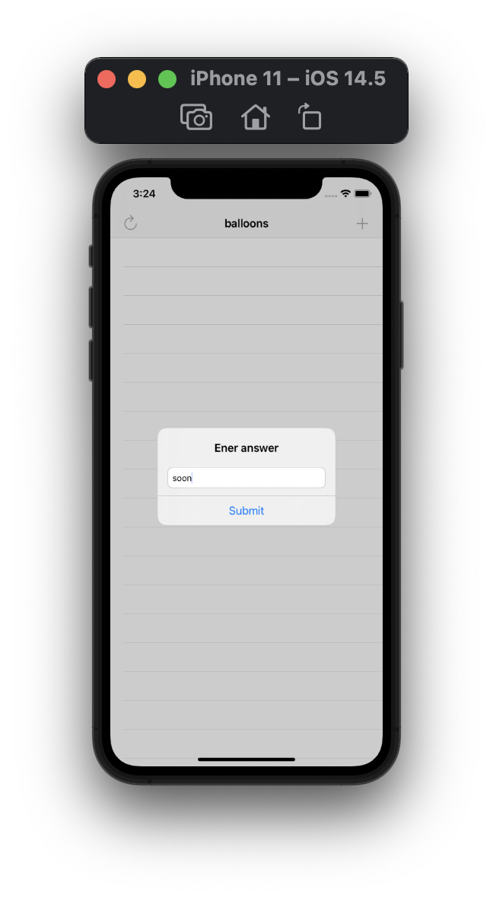
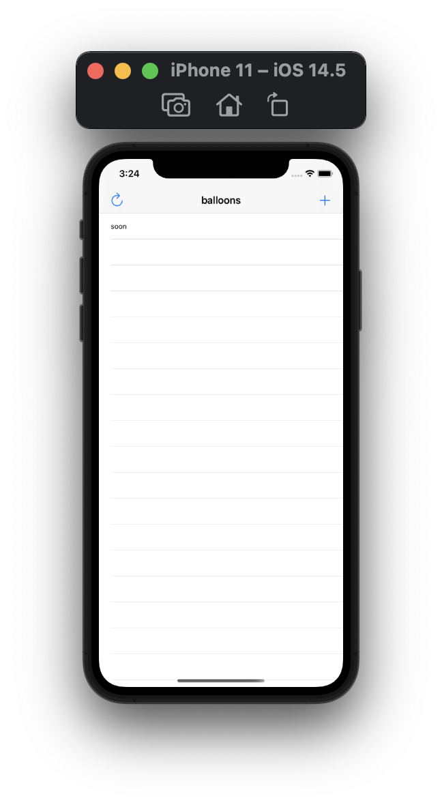
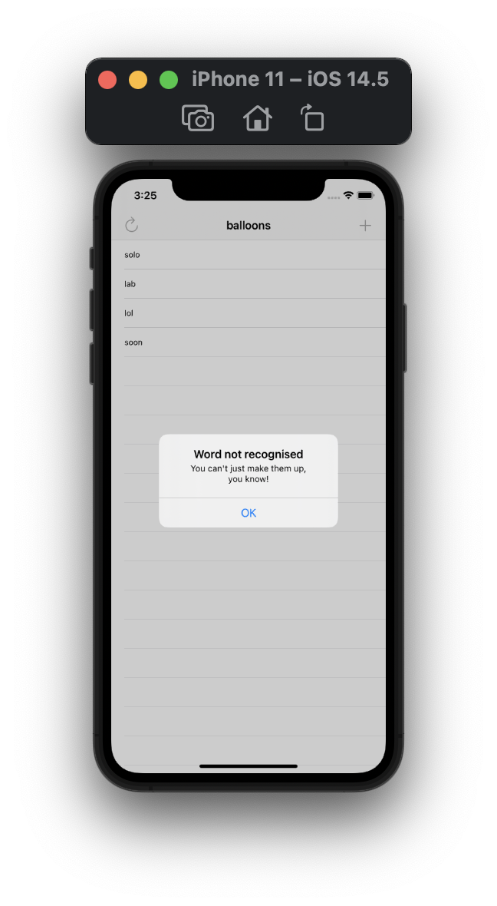

#  Project 5

Fifth iOS developing project in "100 days of Swift" challenge on website: www.hackingwithswift.com

In this project we create simple mini game with anagrams. We learned a little bit more about UITableView: how to reload their data and how to insert rows. We also learned how to add text fields to UIAlertController and some serious core stuff: more about Swift strings, closures, NSRange, and more.

The essence of the game is as follows: this app asks users to make anagrams out of a word, e.g. when given the word “anagrams” they might provide “rags”.

## Demonstration

Start View with a random word from which you want to create anagrams. Button "+" allows add new anagrams. Button with "refresh" image is restarting the game.

Input new anagram.

New anagram added.

The word did not pass validation.

Alert Controller for restarting game.

