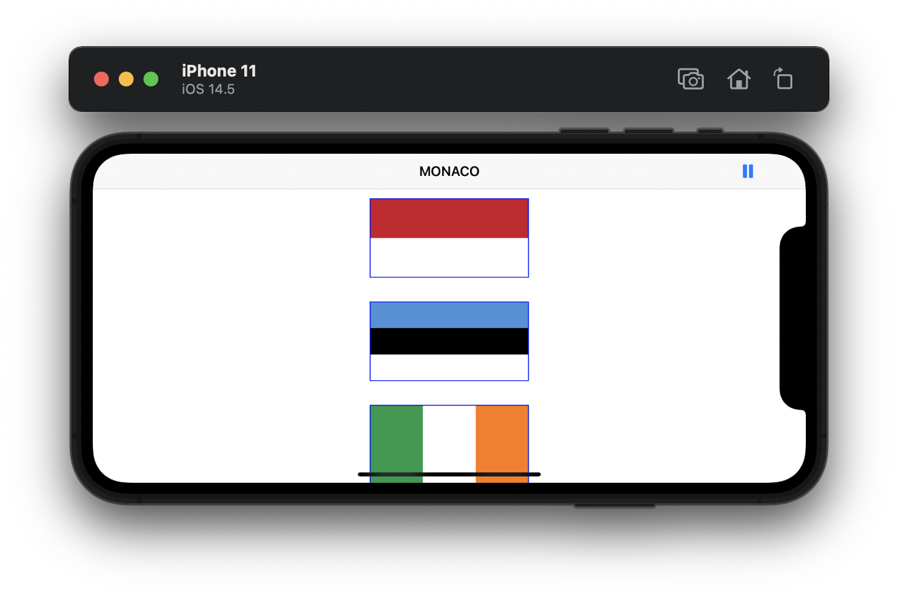
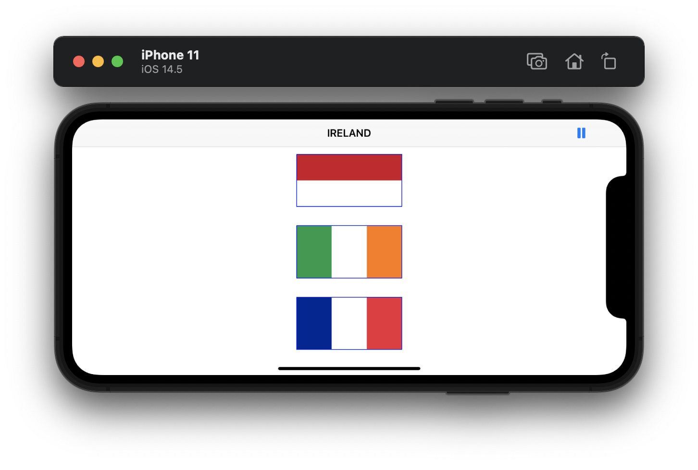

#  Project 6

Sixth iOS developing project in "100 days of Swift" challenge on website: www.hackingwithswift.com

In this project we add some changes in [Project 2](https://github.com/elfortitude/100_Days_of_Swift/tree/main/Project2) and learn more about Auto Layout. We used it in Project 2 to make sure our flag buttons were positioned correctly, but that project has a problem: if you rotate your device, the flags don't fit on the screen! This time we fixed this issue with Auto Layout.

## Demonstration

It was:

Became:

