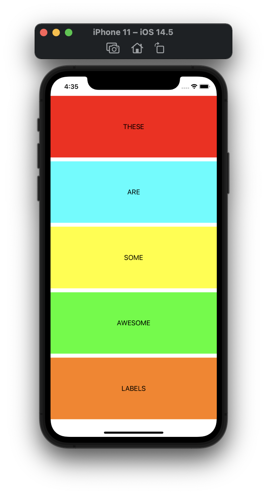

#  Project 6b

Sixth b iOS developing project in "100 days of Swift" challenge on website: www.hackingwithswift.com

In this project we learned yet a bit more about Auto Layout: how to do Auto Layout in code, addConstraints method with Visual Format Language, aspect ratio constraints, Auto Layout anchors. 

## Demonstration

All layout and label customization is done in code.

