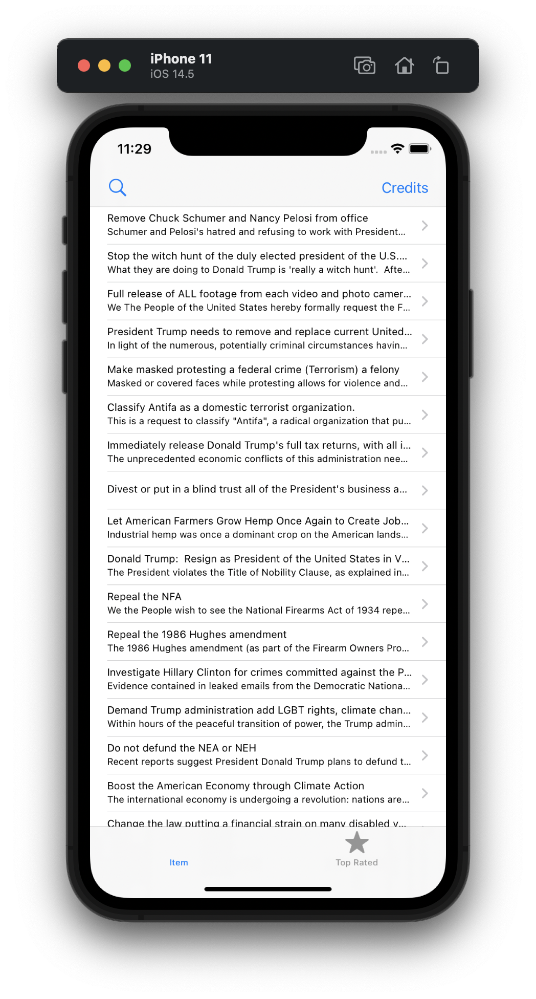
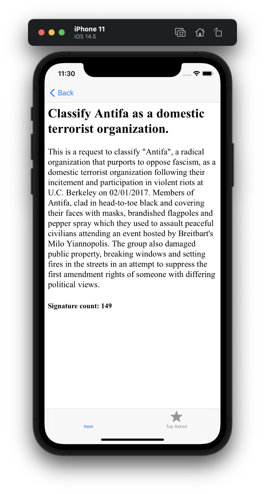
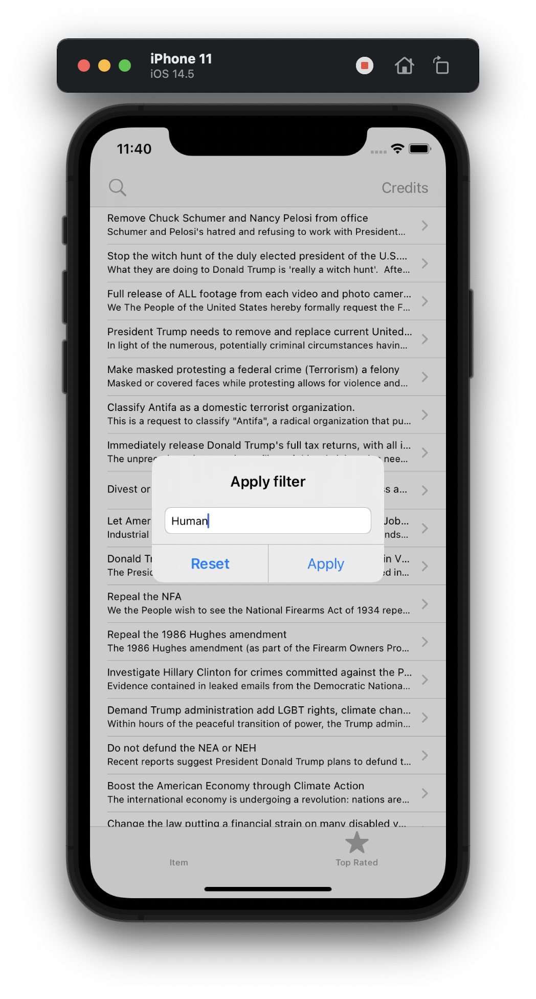
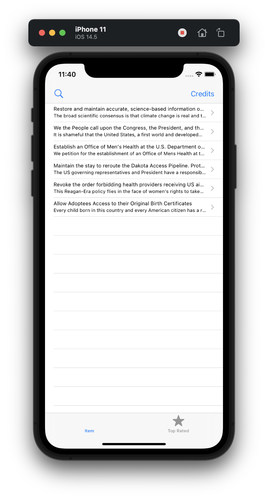

#  Project 7

In this project we created simple viewer of petitions with tabs and ability to view each petitions and its description. We learned UITabBarController, Codable, Data, JSON parsing and UIStoryboard (creating views in code). The filtering function is also implemented.

All data taken through the White House API.

## Demonstration

List of petitions with titles and subtitles (part of description):

Detail view of petition with title, description and signature count using WKWebView and HTML.

Allert controller with text field for filter string. We are looking for matches in the titles or descriptions of petitions using the method contains().

Filtered list:

