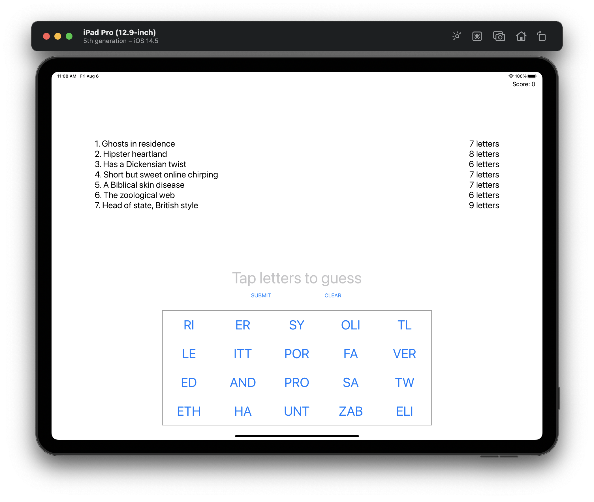
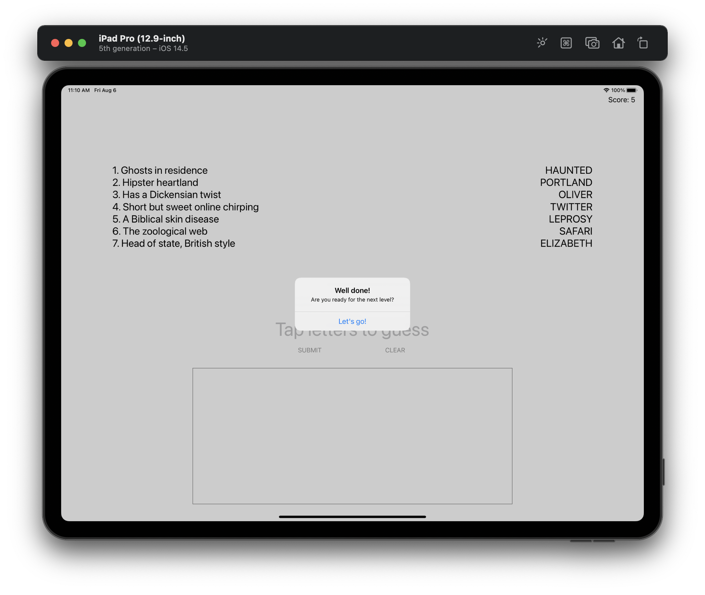

#  Project 8

In this project we created yet another simple game with using UIKit. We went to look how to build complex iOS layouts only programmatically. We learned about text alignment, layout margins, UIFont, adding targets to a button, separating and joining strings, hiding views and more. Also we workd with view containers.

The essence of the game is as follows: a word game based on the popular indie game 7 Little Words. Users see a list of hints and an array of buttons with different letters on, and need to use those buttons to enter words matching the hints. At now game has two levels.

## Demonstration

Level view with letter buttons, disabled text field for view tapped queston, scores, answers and clues. All layout and label customization is done in code.

 
 Alert Controller with message about the player has won a level with a proposal to move to a new level.
 
 

