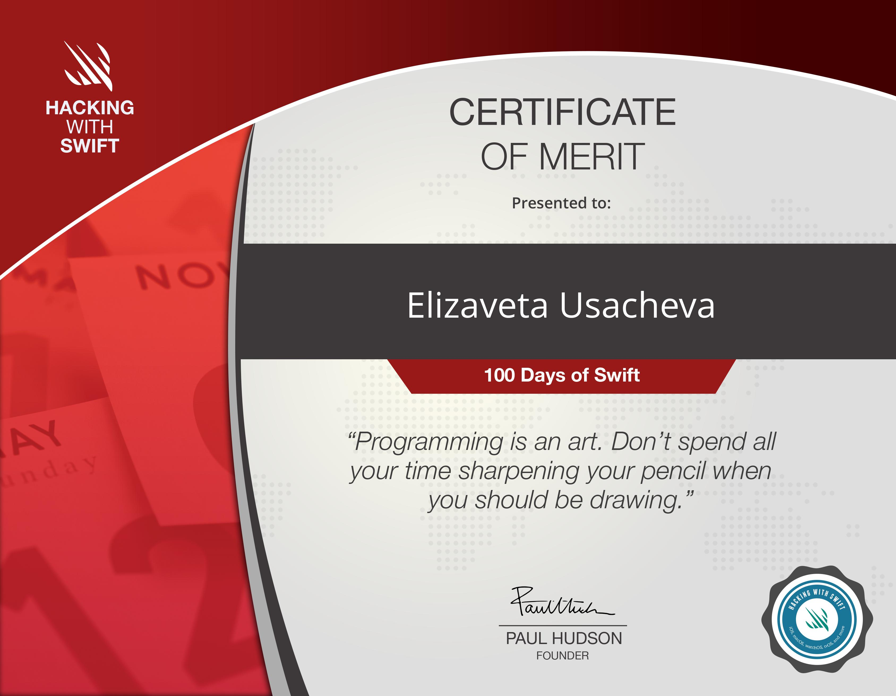

# 100_Days_of_Swift

Learning iOS Developing

This is a my route on "100 days of Swift" challenge on website: www.hackingwithswift.com

There are 30 projects here, as well as 10 unaided projects (Milestone projects). Each directory contains all the necessary files as well .xcodeproj so that they can be run independently. There is also a file for each project README.md, which describes the studied and elaborated topics, and presents a demonstration of the work.

My certificate of successful completion of the course and passing the final exam:

